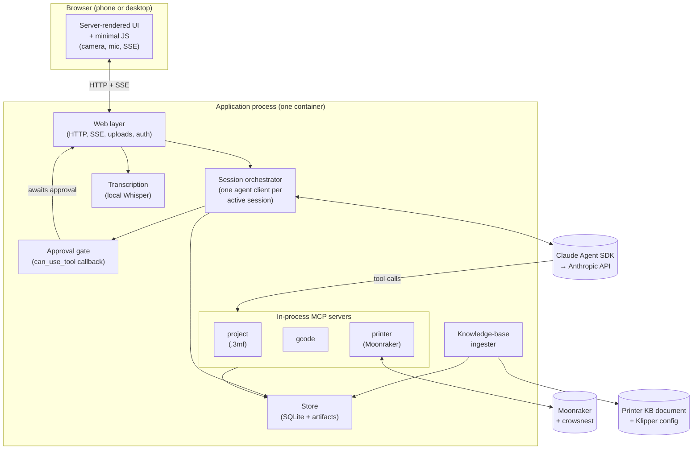
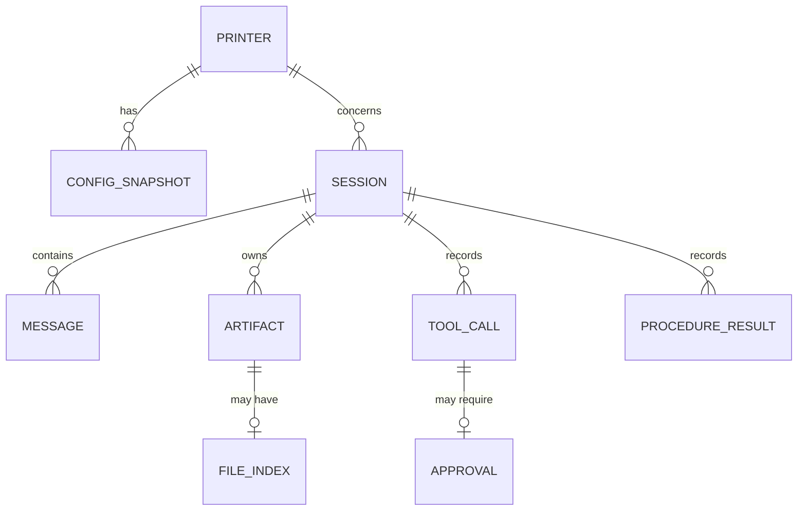
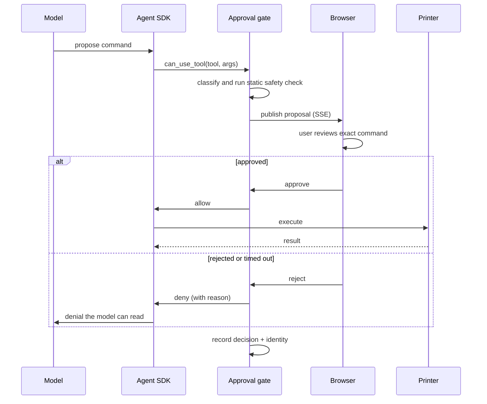

# 3D Printer Debugger — Architecture

This document describes the system architecture that satisfies [spec.md](spec.md). It commits to
the shape of the implementation — component decomposition, data model, control flows, and library
choices — without descending into function signatures, file paths, or package layout. Those
belong to the per-module design documents that follow.

Section references point at [spec.md](spec.md) unless stated otherwise. Decisions and their
rationale are recorded in [decisions.md](decisions.md).

## 1. System overview

The system is a **single Python process** serving a web UI, driving the Claude Agent SDK, and
talking to the printers over Moonraker. Everything runs in one container: the web server, the
agent, the file-extraction tools, and transcription.

Four decisions drive this architecture:

1. **The agent has no reach into the host.** Every Agent SDK built-in that touches the machine —
   shell, file read/write/edit, filesystem search — is disabled. The model affects the world
   only through three in-process MCP servers we control
   ([§3.4](#34-mcp-capability-servers), [§6.1](#61-claude-agent-sdk)). Web search and fetch are
   enabled: they read, they never touch the host, and diagnosis needs them.
2. **The approval gate is a permission callback, not application logic.** Printer writes are
   held by the SDK's `can_use_tool` callback until the user approves in the browser. The gate
   cannot be bypassed by the model, because it sits below the model
   ([§5.3](#53-printer-write-with-approval)).
3. **Large files never enter the context.** `.3mf` and G-code are parsed into a local index once
   at ingest; the model queries that index through bounded tools
   ([§3.4](#34-mcp-capability-servers)).
4. **One process, one container, no external services.** SQLite, in-process MCP servers, and
   local transcription mean a local deployment needs nothing but the Anthropic API
   ([§9](#9-deployment)).

## 2. Architectural principles

- **Deny by default at the capability layer.** The agent cannot do what it has no tool for. New
  capability that acts on the host or the printer means a new, deliberately written tool — never
  a loosened permission.
- **Distinguish reading from acting.** The controls above exist to stop the agent *acting*
  outside its intended surface. Read-only capabilities that touch neither the host nor the
  printer — web search and fetch — carry a different risk and are enabled, because withholding
  them costs real diagnostic ability and buys no host safety.
- **Treat retrieved content as untrusted.** Anything fetched from the web is data, not
  instruction. The approval gate is what makes this safe in practice: no external content can
  reach the printer without a human reading the exact command and approving it.
- **The store is the source of truth.** In-memory state is a derivable cache; a restart loses
  nothing that mattered.
- **Provenance travels with data.** Every value the system reports carries where it came from and
  when it was read ([§5.1](spec.md#51-printer-management)). This is a property of the data
  structures, not a formatting concern at the edges.
- **Bounded responses at every tool boundary.** A tool that could return an unbounded result
  fails with guidance instead of truncating.
- **Degrade, don't fail.** An unreachable printer, an unparseable file, or a failed
  transcription disables one capability and reports why; it never takes down a session.
- **Provider-specific code sits behind a boundary.** Artifact storage and printer access are the
  two seams where an alternative implementation must be substitutable.

## 3. Component decomposition

### 3.1 Web layer

Serves the UI, handles uploads, streams assistant output, and terminates authentication.

- **Rendering** — server-rendered HTML. Hand-written JS covers only what the browser APIs
  require: camera capture, audio recording, upload progress, and consuming the SSE stream. No
  bundler, no framework.
- **Streaming** — assistant output reaches the browser over Server-Sent Events. SSE is
  unidirectional and reconnects natively, which matches the traffic shape: bulk output down,
  occasional small messages up over ordinary POSTs.
- **Uploads** — streamed straight to artifact storage without buffering the whole file in memory.
  The declared size is checked before the body is read
  ([§5.4](spec.md#54-file-ingestion)).
- **Auth** — an OIDC middleware in exposed mode; disabled entirely in local mode
  ([§6.4](#64-identity-provider)).

### 3.2 Session orchestrator

Owns the lifecycle of the agent for each active session. It holds one `ClaudeSDKClient` per
session that currently has activity, configured with:

- the model, adaptive thinking, and an effort level;
- the three MCP servers ([§3.4](#34-mcp-capability-servers));
- a tool allowlist naming only those servers' tools;
- the approval callback ([§3.3](#33-approval-gate));
- the session's system prompt — printer knowledge, procedure catalog, and current state.

A session that is idle holds no client. Resuming re-creates the client against the SDK's stored
session, so a restart or a long gap costs a reconnect, not a lost conversation.

**Conversation persistence is mirrored, not delegated.** The SDK keeps its own session state, and
that state is what makes resume cheap — but [§10](spec.md#10-data-and-persistence-requirements)
requires every message to survive a restart and to be backed up and restored as a unit. The
orchestrator therefore writes each message, tool call, approval, and result into the store as
it happens. The SDK's store is a resumption cache; ours is the record.

### 3.3 Approval gate

A permission callback registered with the SDK. It is consulted before any tool the allowlist does
not auto-approve — which, by construction, is every printer write.

On invocation it:

1. Classifies the pending call. Reads and extractions are allowed immediately.
2. For a write, records the proposal in the store and publishes it to the session's SSE stream.
3. Blocks that turn until the user approves or rejects, or the request times out.
4. Returns allow or deny to the SDK, and records the outcome with the identity that decided it.

This is the whole enforcement mechanism for [§5.5](spec.md#55-printer-interaction).
Because the gate is a callback the SDK invokes — not a convention the prompt asks the model to
follow — no prompt content can route around it. A refused action returns a denial the model can
read and respond to.

Dangerous-action classification (unhomed movement, out-of-limit moves, cold extrusion, heater
safety parameters) happens here as a static check on the pending command, independent of what the
model believes about it.

### 3.4 MCP capability servers

Three servers, created in-process via the SDK's SDK-MCP mechanism. In-process rather than stdio
subprocesses: the tools need the same artifact store, printer connections, and parsed-file caches
the rest of the process holds, and a subprocess boundary would mean serializing all of it.

| Server | Exposes | Backed by |
| --- | --- | --- |
| `project` | Settings, overrides, layout, thumbnails, geometry renders | `.3mf` index + mesh |
| `gcode` | Layer/coordinate lookup, feature and state queries, anomalies | G-code index |
| `printer` | Live state, config, logs, webcam still; proposed writes | Moonraker client |

Every tool enforces its own response ceiling and returns a narrowing hint when a request would
exceed it.

### 3.5 File indexers

Run once when a file is ingested, producing a compact index stored alongside the artifact.

- **`.3mf`** — a zip of XML, JSON, and mesh. Settings, metadata, and thumbnails are parsed at
  ingest into a small index; the mesh is retained in the stored artifact and rendered to
  intended-geometry views on demand, never loaded into the index.
- **G-code** — hundreds of megabytes, and the interesting queries are positional. The indexer
  makes a single pass, recording layer boundaries with their byte offsets and Z heights,
  per-layer feature and extrusion summaries, XY bounding boxes per object and per layer, and
  **a full machine-state snapshot at the start of every layer** so cumulative state (temperatures,
  fan, acceleration, pressure advance, extrusion mode) at an arbitrary point can be reconstructed by
  replaying from the snapshot at the start of the containing layer rather than from the start of
  the file.

The index is what makes [§7](spec.md#7-large-file-access-requirements) affordable: queries
are offset lookups plus a bounded re-read, never a full scan.

### 3.6 Printer client

Wraps Moonraker. Provides read access to state, configuration, saved values, logs, and webcam
stills; and command submission, reached only through the approval gate.

The **three-tier distinction** from [§5.5](spec.md#55-printer-interaction) is explicit
in the client's return types: configured values, saved values, and runtime state are separate, each
tagged with its source and read time. Runtime state has no stored fallback and the client says so
rather than substituting a saved value.

Connections are per-printer, lazily established, and health-checked. Unreachability is a normal
return, not an exception that propagates into the session.

### 3.7 Knowledge-base ingester

Watches the printer knowledge-base document. On change: splits it into per-printer sections,
extracts name, address, and config path from each via a model call, caches the result keyed by
content hash, and retains each section's raw text for the orchestrator to put in the system
prompt. Also imports Klipper configuration from the referenced paths or from Moonraker, stores it
as a timestamped snapshot, and records discrepancies between sources for later use.

### 3.8 Store

Two halves behind one interface:

- **Structured data** in SQLite: sessions, messages, tool calls, approvals, printers, snapshots,
  procedure results, usage. One file; trivially backed up.
- **Artifacts** on a blob interface: uploaded `.3mf` and G-code, their indexes, photos, webcam
  stills, procedure outputs. Local filesystem locally, object storage in a cloud deployment. This
  is the substitutable seam required by
  [§10](spec.md#10-data-and-persistence-requirements).

### 3.9 Transcription

Local Whisper, invoked on uploaded audio. Runs in-process on CPU. Keeps [§9](#9-deployment) of the
spec's "no cloud account required locally" true and keeps workshop audio inside the deployment.
Model weights ship in the image, pinned by version.

## 4. Data model

| Entity | Key contents |
| --- | --- |
| `printer` | Name, address, config path, KB section text, KB content hash |
| `config_snapshot` | Printer, source (files or live), captured-at, parsed contents |
| `session` | Name, printer, state, SDK session id, created/last-active, usage totals |
| `message` | Session, role, content blocks, created-at |
| `tool_call` | Session, server, tool, arguments, result summary, timing |
| `approval` | Tool call, decision, deciding identity, decided-at |
| `artifact` | Session, kind, blob key, size, content type, captured-at |
| `file_index` | Artifact, kind, index blob key, format version |
| `procedure_result` | Session, procedure, printer, filament, values, evidence artifacts |

Two notes on this model:

**`procedure_result` carries both printer and filament**, and the filament column is null exactly
for machine calibrations. That is the enforcement point for
[§5.6](spec.md#56-calibration-procedures)'s rule that every filament calibration is scoped to a
filament on a specific printer — it is a shape constraint, not a convention.

**Runtime printer state is deliberately absent.** It is captured as an `artifact` when a session
records it, and is otherwise read live. There is no table for it, because a stored row would
invite exactly the substitution [§5.1](spec.md#51-printer-management) of the spec forbids.

## 5. Key control flows

### 5.1 Session creation

1. User uploads a `.3mf` (or starts without one).
2. Web layer streams it to artifact storage, checking declared size first.
3. The `.3mf` indexer runs; printer identity is read from the project's printer preset, nozzle
   diameter, and printable area.
4. That identity is matched against ingested printers. Confident match binds silently; ambiguity,
   no match, or no project file prompts the user.
5. A session row is created; the orchestrator starts a client with the bound printer's knowledge
   in the system prompt.
6. The model names the session from the opening content; the name is stored and renameable.

### 5.2 A conversation turn

1. Browser POSTs text, or audio (transcribed first), or a message with images attached.
2. Orchestrator appends to the store and hands the turn to the SDK client.
3. SDK streams back thinking, text, and tool calls. Text deltas are forwarded to the browser over
   SSE as they arrive.
4. Tool calls run in-process against the MCP servers. Reads proceed; writes divert to
   [§5.3](#53-printer-write-with-approval).
5. Each message, tool call, and result is written to the store as it completes.
6. The turn ends; the browser has the full response and the store has the record.

### 5.3 Printer write with approval

The gate blocks one turn, not the process — other sessions proceed. A timeout is a denial, so a
user who walks away never leaves a command armed.

### 5.4 Defect location

Combines the four routes from [§5.7](spec.md#57-diagnosis) of the spec against the G-code index:

- A measured height or stated layer resolves through the layer table to a byte range.
- A photo matched against the plate image resolves to an object and an XY region, which the
  index's per-object bounding boxes turn into candidate line ranges.
- Conversational narrowing queries feature transitions and layer anomalies to propose candidates.
- Machine state at the located point is reconstructed from the snapshot at its layer's start.

The model composes these; the tools supply bounded answers and the state reconstruction.

### 5.5 Startup

1. Load configuration; refuse to start if the mode is unset or contradictory
   ([§11](#11-security) of the spec).
2. Open the store; run migrations.
3. Ingest the knowledge-base document; import configuration snapshots where reachable.
4. Probe each printer; record reachability without blocking startup.
5. Bind the listener and **print every externally reachable URL**, loopback clearly labelled
   local-only ([§9](spec.md#9-deployment-requirements) of the spec).

## 6. External integrations

### 6.1 Claude Agent SDK

The `claude-agent-sdk` Python package. It supplies the agent loop, context management, session
persistence and resume, streaming, image input, MCP hosting, and the permission system. Used via
its persistent-client interface, one client per active session.

**Its host-touching built-ins are disabled; its web tools are not.** The SDK ships file
read/write/edit, shell execution, filesystem search, and web access. These are two different
risk classes and are configured differently:

| Built-in | Setting | Why |
| --- | --- | --- |
| Shell execution | Disabled | Arbitrary code execution on a host on the printer network |
| File read/write/edit | Disabled | Host filesystem access; nothing here needs it |
| Filesystem search | Disabled | Same surface, same reasoning |
| Web search, web fetch | **Enabled** | Read-only, never touches the host, and diagnosis needs it |

Withholding the web tools would buy no host safety and would cost real capability: the firmware
error strings, vendor quirks, and community fixes this domain runs on are not all in the model's
training data, and this hardware moves ([§5.7](spec.md#57-diagnosis) of the spec).

For the host-touching set, configuration says the same thing four independent ways:

- the allowlist names only our MCP tools and the two web tools;
- the host-touching built-ins are explicitly disallowed;
- the permission mode denies anything unlisted rather than prompting;
- the approval callback gates the writes we do intend.

That is proportionate for the one setting whose failure mode is arbitrary code execution next to
a printer.

**Retrieved web content is untrusted input.** A page can contain text shaped like an
instruction. The containment is structural rather than prompt-based: the web tools cannot reach
the printer, and every printer write stops at the approval gate with the exact command shown to a
human ([§3.3](#33-approval-gate)). The system prompt additionally requires web-derived claims to
be cited and ranked below first-hand evidence from the artifacts, configuration, and live state.

Model, thinking mode, and effort are configuration, defaulting to the current Opus model with
adaptive thinking. Long sessions rely on the SDK's context management; the system prompt is built
stable-first so its prefix caches.

### 6.2 Moonraker

HTTP for queries and one-shot commands, WebSocket for live state. Unauthenticated on a trusted
LAN ([§8](spec.md#8-printer-access-requirements) of the spec). Webcam stills come from crowsnest's
snapshot endpoint. Emergency stop is a direct call from the web layer that bypasses the agent
entirely — it must work when the model is mid-turn, wedged, or unreachable.

### 6.3 Transcription

Local Whisper, pinned by version, weights baked into the image. A failure returns an error the UI
surfaces with the audio retained, so the user can retry or type instead.

### 6.4 Identity provider

Any OIDC provider, in exposed mode only. The application holds an allowlist of accepted subjects,
all mapping to one system user. Local mode never contacts it.

## 7. Concurrency model

Async throughout, since nearly everything is I/O: model streaming, Moonraker sockets, uploads,
SSE fan-out.

- **One agent client per active session**, each an independent async task. Sessions do not share
  agent state.
- **File indexing and transcription are CPU-bound** and run in a worker pool so they cannot stall
  the event loop.
- **Blocking approval waits are per-turn**, implemented as an awaited future the web layer
  resolves. They hold no locks.
- **SQLite** is accessed through a single writer with WAL enabled. At one user's concurrency this
  is ample and avoids a write-lock class of bugs entirely.
- **Moonraker connections are per-printer and shared** across sessions, with reads multiplexed.

## 8. Failure and recovery

| Failure | Behaviour |
| --- | --- |
| Printer unreachable | Live tools unavailable with reason; session continues on snapshots |
| Printer drops mid-procedure | Reported plainly; last action **not** assumed to have completed |
| Model API error | Turn fails with the error surfaced; conversation intact; user may retry |
| Malformed upload | Rejected at ingest naming the problem; no partial artifact retained |
| Index format outdated | Detected by version; index rebuilt from the retained artifact |
| Transcription failure | Reported; audio retained; text entry unaffected |
| Process restart | Sessions resume from the store; in-flight approvals expire as denials |
| Store unavailable | Fatal — refuse to serve rather than accept work that will be lost |

## 9. Deployment

One container image holding the application, its MCP servers, and the Whisper weights.

- **Local** — `docker compose up`; SQLite and artifacts on a mounted volume; local mode; no cloud
  account, no identity provider.
- **GCP** — the same image on a Compute Engine VM with a persistent disk, artifacts in Cloud
  Storage, exposed mode with OIDC. Not Cloud Run: a request-scoped autoscaler is the wrong shape
  for this system. Its request timeout caps SSE streams and blocked approval waits, scale-to-zero
  discards the in-memory agent clients a live session depends on, more than one instance breaks
  the single-writer discipline SQLite relies on, and it has no persistent local disk. A small
  always-on VM costs more than scale-to-zero and removes all four problems
  ([design/store.md](design/store.md)).
- **Other providers** — any container host. Only the artifact backend and the volume are
  provider-shaped, and both sit behind interfaces.

Dependencies — Python packages, base image, Whisper model — are pinned to specific versions; no
moving tags.

### 9.1 Configuration

Configuration is supplied two ways, split by nature, and this is the single authoritative
description of the mechanism — the design documents that call a value "configurable" mean a key
here.

- **A YAML configuration file holds all non-secret settings.** Its path comes from one bootstrap
  environment variable with a sensible default. It is not committed to the repository. Nested and
  structured settings — the artifact backend and its parameters, the OIDC block, the upload
  limits — live here because they read naturally as structure and badly as flat variables.
- **Secrets come only from the environment** — the model API key, and in exposed mode the OIDC
  client secret. Never from the file, never from the repository, never in logs
  ([§11](#11-security)). A cloud secret manager satisfies this by populating the environment.
- **Defaults live in code.** The file overrides them; anything unset uses the default. A minimal
  file — or none, in a fully-defaulted local run — is valid.
- **Everything is validated at startup**, and the process refuses to serve on anything missing or
  contradictory: an unset or inconsistent mode, exposed mode without an identity provider, a
  configuration path that does not resolve, an artifact backend without its parameters. This is
  the same fail-fast rule the mode already follows ([§11](#11-security)), generalised to all
  configuration.

The configuration surface, by nature:

- **Secrets — environment only.** The model API key, and in exposed mode the OIDC client secret.
- **Deployment wiring — file.** Mode; bind address; the artifact backend and its parameters; the
  store, KB-document, and config-file-base paths; and the OIDC issuer, client id, and subject
  allowlist.
- **Tunables — file, defaulted in code.** KB poll interval; upload size limits; approval timeout;
  voice-message cap; model and effort; `busy_timeout`.

The **config-file base** deserves its own note, because it is what resolves the open question the
knowledge-base document raised: the user's Klipper configuration paths are written with a `~` that
means nothing inside a container. The deployment mounts the user's configuration tree at a known
location and sets that location as the config-file base; the ingester resolves each path against
it rather than expanding `~`
([design/kb_ingestion.md §3.4](design/kb_ingestion.md#34-completeness-and-missing-values)).

## 10. Observability

- **Structured logging** of tool calls, printer interactions, approvals and their deciding
  identity, model errors, and ingestion outcomes. Secrets never logged.
- **Per-session usage** accumulated from the SDK's reported token counts, viewable on request
  ([§12](spec.md#12-non-functional-requirements) of the spec). No enforced limit.
- **Health endpoint** reporting store reachability, printer reachability, and the active mode.
- **Approval audit** — every executed printer command is reconstructable from the store, with
  what was proposed, who approved it, and what the printer returned.

## 11. Security

- **Mode is explicit configuration.** Unset or contradictory means refuse to start.
- **Local mode** serves unauthenticated on the LAN, deliberately.
- **Exposed mode** requires OIDC and TLS; unlisted subjects are rejected before any handler runs.
- **The capability surface is the primary control.** The agent has no shell, no filesystem
  access, and no way to reach the printer except through tools we wrote.
- **Web access is read-only and cannot act.** The agent can search and fetch, but nothing it
  retrieves can execute anything — on the host or the printer. Prompt injection from a fetched
  page is contained by the approval gate, not by asking the model to be careful.
- **Every printer write is attributable** to a recorded approval.
- **Secrets** come from the environment or a secret store, never the repository or the logs.
- **Uploaded artifacts and photos are sent to the model provider** in normal operation; stated in
  the documentation.

## 12. Library and technology choices

| Concern | Choice | Why |
| --- | --- | --- |
| Language | Python | First-class Claude Agent SDK support; ecosystem for file parsing and audio |
| Agent | `claude-agent-sdk` | Supplies loop, sessions, streaming, MCP hosting, permissions |
| Web framework | An async Python framework | Async, SSE, streamed uploads; chosen in that module |
| UI | Server-rendered + hand-written JS | No build step, no bundler, one artifact |
| Streaming | SSE | Unidirectional, auto-reconnecting, matches the traffic shape |
| Structured store | SQLite (WAL) | One file, no service, identical locally and in a container |
| Artifacts | Filesystem or object storage behind one interface | The provider-substitutable seam |
| `.3mf` parsing | Standard-library zip + XML/JSON | A zip of XML and JSON; no dependency needed |
| Mesh rendering | Headless mesh renderer | Renders intended geometry to compare against a photo |
| G-code indexing | Purpose-written | The queries are positional and specific; no library fits |
| Printer | Moonraker HTTP + WebSocket | The Klipper interface |
| Transcription | Local Whisper | No external account; audio stays local |
| Packaging | One container image | Same artifact locally and in cloud |

## 13. What this document deliberately does not specify

- Function signatures, module layout, and file paths.
- The exact web framework, SQLite driver, Whisper implementation, and their versions — pinned at
  implementation time.
- The MCP tool signatures and parameters. [§7](spec.md#7-large-file-access-requirements) of the spec
  states what must be extractable; the tool surface is the MCP module's design.
- The G-code index's on-disk format.
- The procedure catalog's contents. Each procedure's preconditions, steps, and interpretation
  belong in the procedures module's design.
- Prompt content and structure, beyond the requirement that it be stable-prefix-first for caching.
- HTML, CSS, and the visual design of the interface.

## 14. Module design documents to follow

Each becomes its own design document, in roughly this order:

1. **Store** — schema, migrations, artifact interface, backup and restore.
2. **Knowledge-base ingestion** — parsing, extraction, snapshotting, discrepancy detection.
3. **File indexing and MCP tools** — index formats and the full tool surface.
4. **Printer access** — Moonraker client, three-tier state, emergency stop.
5. **Session orchestration and the approval gate** — SDK configuration, lifecycle, enforcement.
6. **Web layer and UI** — routes, SSE, uploads, capture, approval interface.
7. **Procedures** — the catalog and how results are recorded and scoped.
