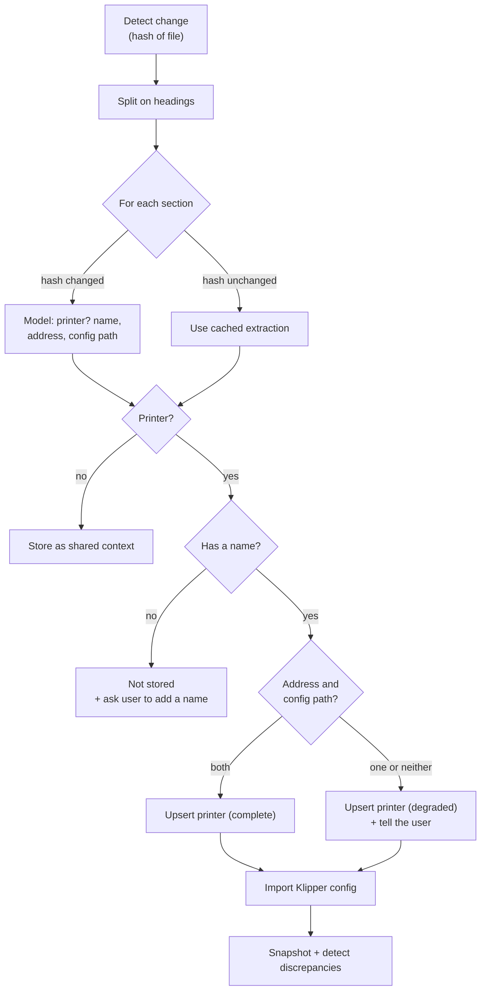

# Knowledge-base ingestion — module design

This module turns the user's hand-written printer document, and the Klipper configuration it
points at, into the `printer` and `config_snapshot` records everything else reads.

Requirements: [spec.md §5.1](../spec.md#51-printer-management). Component:
[architecture.md §3.7](../architecture.md#37-knowledge-base-ingester).

## 1. Scope

**In scope:** watching the document, splitting it into sections, extracting the three required
values, retaining prose for the prompt, importing Klipper configuration, snapshotting it, and
detecting disagreements between sources.

**Out of scope:** writing to the document. The file belongs to the user
([decisions.md](../decisions.md)); this module reads it and never modifies it. Suggested edits are
produced by the agent as text, not applied here.

## 2. Design decisions

### 2.1 The document has no schema, and the model does the reading

Sectioning is mechanical — split on markdown headings. Everything after that is a model call.
Each section is handed to a small fast model, which answers two things: is this a printer, and if
so what are its name, address, and configuration path.

This matters more than it first appears. The example document
([examples/printer_definition.md](../examples/printer_definition.md)) contains `## Slicer`,
`## Materials`, `## Filament storage`, `## Known problems`, and `## Planned changes` alongside the
printer sections. No heuristic reliably separates "a printer" from "a section about printers", and
any rule strong enough to try would break the moment the user reorganises their own file. Asking
is robust and costs one cheap call per section, cached.

A **small fast model** is used, not the agent's model: extracting three values from a section of
prose is mechanical, and this runs on every document change.

### 2.2 Extraction is cached by content hash

The hash of a section's text keys its extraction result in a `section_cache` table
([design/store.md §4.12](store.md#412-section_cache)). An unchanged section is never re-extracted,
so editing one printer's notes costs one model call, not one per printer, and a restart with an
unchanged document costs none.

The cache holds **every** section's result, not only printers. A section classified as not a
printer has no printer row to record its hash against, so without this table it would be re-sent to
the model on every document change — undercutting the whole point of the cache. Keying on the
section hash regardless of the outcome is what makes the claim above hold for the non-printer
sections too.

### 2.3 Non-printer sections are kept as shared context

`## Slicer`, `## Materials`, `## Filament storage` and anything else that is not a printer are
retained and made available to every session, not discarded. They carry real diagnostic content —
which slicer, which materials, how filament is stored — that applies regardless of which printer a
session concerns.

## 3. Ingestion flow

### 3.1 Change detection and removal

The document is hashed on a configurable interval, defaulting to 60 seconds
([architecture.md §9.1](../architecture.md#91-configuration)), and at startup. A changed hash
triggers re-ingestion. Polling rather than filesystem events: the file may live on a mounted path
where events are unreliable, the document changes rarely, and hashing a file this size is trivial.
A just-made edit therefore takes up to the interval to be noticed; a manual "update now" control
that forces an immediate re-ingest is future work ([spec.md §14](../spec.md#14-future-work)).

Re-ingestion is **upsert, never replace**. A printer keeps its identity across edits so sessions
that reference it stay valid. Matching is by name; a renamed section is a new printer, and the old
one remains with its sessions intact. Sessions do not follow a rename — see
[§9](#9-resolved-questions).

A printer whose section is **removed** from the document is not deleted — its sessions still
reference it. Instead its `absent_since` timestamp is set
([design/store.md §4.2](store.md#42-printer)), and the printer is shown in listings as no longer
present in the document. This distinguishes it from a printer that is merely offline: an offline
printer is reachable again later; a removed one is gone from the source of truth and will receive
no further updates. If the section reappears — the same name is seen again — `absent_since` is
cleared and normal upsert resumes. Deletion of the row itself is not in this version, consistent
with the rest of the system ([spec.md §14](../spec.md#14-future-work)).

### 3.2 Sectioning

Split on the heading level that separates printers. The example document uses `##` under a single
`#` title. The level is determined per document — the most common heading level below the title —
rather than hard-coded, since the user may write `#` for each printer instead.

Content before the first section heading is preamble and joins the shared context.

### 3.3 Extraction

One call per changed section, asking for a small structured result: whether the section describes
a printer, and its name, address, and configuration path when it does. Structured output is used
so the result is validated rather than parsed out of prose.

Values are normalised on the way in: a hostname is stripped of backticks and surrounding text, and
a path is resolved against the config-file base, a configuration setting naming where the user's
Klipper tree is mounted ([architecture.md §9.1](../architecture.md#91-configuration)) — not by
expanding `~`, which means nothing inside a container. The example document writes these inside
code spans and with trailing parentheticals, and the model returns what it read.

### 3.4 Completeness and missing values

The three extracted values do not gate the same things, so their absence is handled differently.

**Name is the identity and cannot be absent.** It is the matching key and is unique in the schema
([design/store.md §4.2](store.md#42-printer)); a printer with no name cannot be stored or matched
on the next ingest. A section that reads as a printer but yields no name is **not stored at all**.
The user is told which section it was — identified by its position and heading — and asked to give
it a name. Nothing about it is guessed from the heading, since the extraction step exists precisely
because headings are not reliably the name.

**Address and configuration path degrade rather than reject.** A printer missing either is stored
with `status = 'degraded'` and a `missing` list naming what is absent, stays usable in that form,
and the user is told what is missing and what it disables. One bad section never fails the ingest
or blocks another printer, per [spec.md §5.1](../spec.md#51-printer-management).

The two disable different capabilities, and `missing` records which:

| Absent | Consequence |
| --- | --- |
| Address | No live features at all — no state, no logs, no live config, no webcam |
| Configuration path | No offline snapshot; live config still works when the address is present |

So `degraded` means "the document did not supply everything", not "this printer cannot work". A
printer with an address but no local config path is degraded, yet fully functional whenever it is
reachable, because its configuration comes live from Moonraker
([§4](#4-klipper-configuration-import)).

## 4. Klipper configuration import

Two sources, per [spec.md §5.1](../spec.md#51-printer-management):

- **Local files** at the configuration path from the section, read recursively, following
  `[include]` directives.
- **Live from Moonraker** when the printer is reachable, which returns the running configuration
  including the values Klipper saved itself.

Both are stored as `config_snapshot` rows tagged with their source and capture time. Snapshots
accumulate; the newest is a query.

Parsing produces a section-and-key structure — Klipper's format is INI-like, with `[section]`
headers and `key: value` pairs. The parse must retain:

- **Active values**, the ones in effect.
- **The `SAVE_CONFIG` block**, which Klipper appends and which supersedes what came before.
- **Commented-out values**, kept separately rather than discarded. This is not fastidiousness:
  the example document's printers both have commented-out PID values that no longer match the
  saved ones, and noticing that is the point of the next section.

## 5. Discrepancy detection

Comparison happens across three sources — local files, live configuration, and commented-out
values within the files — and records what disagrees. Recorded at ingest, raised only when the
value in question becomes relevant, with the full list available on request
([spec.md §5.1](../spec.md#51-printer-management)).

Three kinds are detected:

| Kind | Example |
| --- | --- |
| Saved value supersedes file value | `bed.cfg` sets a PID; `SAVE_CONFIG` has a different one |
| Commented-out differs from active | A commented `pid_kp` no longer matching the live one |
| Local files differ from live config | The repository has changes not applied to the machine |

The second kind requires the comment scan above: a comment matching a `key: value` shape for a key
whose active value lives in the same **Klipper configuration section** — the logical `[section]`
after all files and the `SAVE_CONFIG` block are merged, not the same file region — is a candidate,
and a differing value makes it a discrepancy. The example's stale bed PID is exactly this: the
comment sits in `bed.cfg`'s `[heater_bed]` while the effective value is `SAVE_CONFIG`'s
`[heater_bed]` in `printer.cfg`, two files but one logical section. Comments that are prose are
ignored.

**Detection never edits anything.** The output is a record and, when relevant, a sentence in a
conversation.

## 6. What the orchestrator receives

For a bound printer:

- The printer's **raw section text, verbatim**. Not a summary — the prose is the value, and
  summarising it would discard exactly the detail that makes diagnosis specific
  ([architecture.md §3.2](../architecture.md#32-session-orchestrator)).
- The **shared context sections**.
- The **newest configuration snapshot**, with its source and capture time.
- The **recorded discrepancies** for that printer.

## 7. Failure handling

| Failure | Behaviour |
| --- | --- |
| Document missing at startup | Fatal — no printers means nothing works |
| Document unreadable mid-run | Keep the last good ingest; report; retry next interval |
| Document parses to zero printers | Report prominently; keep previously ingested printers |
| Printer section yields no name | Not stored; user told which section, by position and heading |
| Printer removed from the document | Row kept; `absent_since` set; shown as no longer present |
| Extraction call fails | Section keeps its previous extraction if any; else degraded, retried |
| Extraction returns nonsense | Validated by structured output; failed validation is a failed call |
| Config path does not resolve | Degraded; `missing` records it; live config works if reachable |
| Config parse error | Snapshot not written; error names file and line; last snapshot kept |
| Printer unreachable for live import | Local files used; the absence is recorded, not an error |

## 8. Testing

- **The example document is a fixture.**
  [examples/printer_definition.md](../examples/printer_definition.md) is the reference input, and
  its two deliberately dissimilar printers are the parsing test.
- **The real document shape is tested**, including the non-printer sections, preamble, values
  inside code spans, and parenthetical text after a hostname.
- **The extraction model call is injected** as a module-level function variable so tests supply
  results without network access. This is not a mock of a dependency whose behaviour must be
  reproduced — it returns three strings — so a test double is honest here.
- **Klipper parsing is tested against real configuration files**, including a `SAVE_CONFIG` block,
  `[include]` directives, and commented-out values.
- **Each discrepancy kind gets a test** proving it is detected and that a matching value is not
  reported.
- **Cache behaviour is tested** for every section kind: an unchanged section does not call the
  model, whether it is a printer or not; a changed section does; one changed section does not
  invalidate the others.
- **Degraded paths assert both outcomes** — that the printer exists and is usable, and that
  `missing` names the right thing — including that a config-path-only absence leaves the printer
  usable via live import.
- **Name rejection is tested**: a printer section with no name produces no row and a message
  naming the section, and does not fail the ingest of the others.
- **Removal is tested**: a printer dropped from the document keeps its row with `absent_since`
  set, and its reappearance clears it.

## 9. Resolved questions

None open. Two questions raised here have been settled:

1. **Poll interval.** Default 60 seconds, a tunable in the config file
   ([architecture.md §9.1](../architecture.md#91-configuration)). A minute picks up a hand edit
   quickly while keeping polling a non-cost. The lag it leaves after a deliberate edit is
   addressed by the future-work "update now" control ([spec.md §14](../spec.md#14-future-work)),
   not by polling faster.
2. **Renamed section handling.** A rename stays remove-plus-add: the old printer is flagged
   `absent_since` with its sessions intact, and the new name becomes a fresh printer with none.
   Sessions do **not** follow a rename. The document gives no reliable way to tell a rename from
   an unrelated add-plus-remove, so the system does not guess — a wrong guess would silently
   reattribute a session's history to a different machine, which is worse than leaving the old
   sessions on the old, now-absent printer where they are still correct.

## 10. Implementation tasks

- [x] **T3.1** Document watcher: hashing, interval polling, startup ingest.
- [x] **T3.2** Sectioning: heading-level detection, section split, preamble handling.
- [x] **T3.3** Extraction: structured model call, normalisation, `section_cache` lookup and write
      keyed by section hash for every section.
- [x] **T3.4** Printer upsert: degraded status and the missing list, name-absent rejection, and
      removal flagging via `absent_since` including reappearance.
- [x] **T4.1** Klipper configuration parser: sections, keys, `[include]`, `SAVE_CONFIG`,
      retained comments.
- [x] **T4.2** Local file import and snapshot writing.
- [x] **T4.3** Moonraker live configuration import (depends on the printer access module).
- [x] **T5.1** Discrepancy detection for all three kinds, with recording.
- [x] **T6.1** Assembling the orchestrator's view: section text, shared context, newest snapshot,
      discrepancies.
