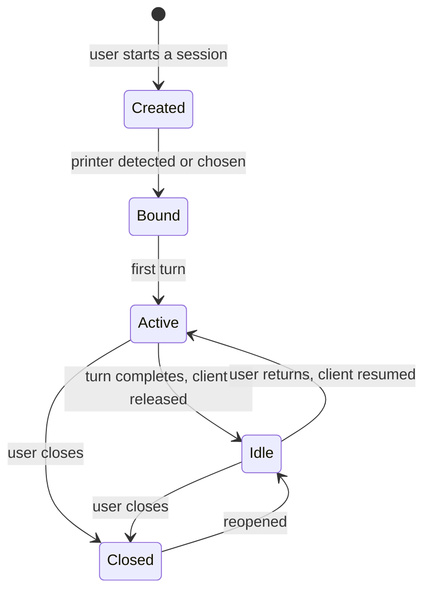
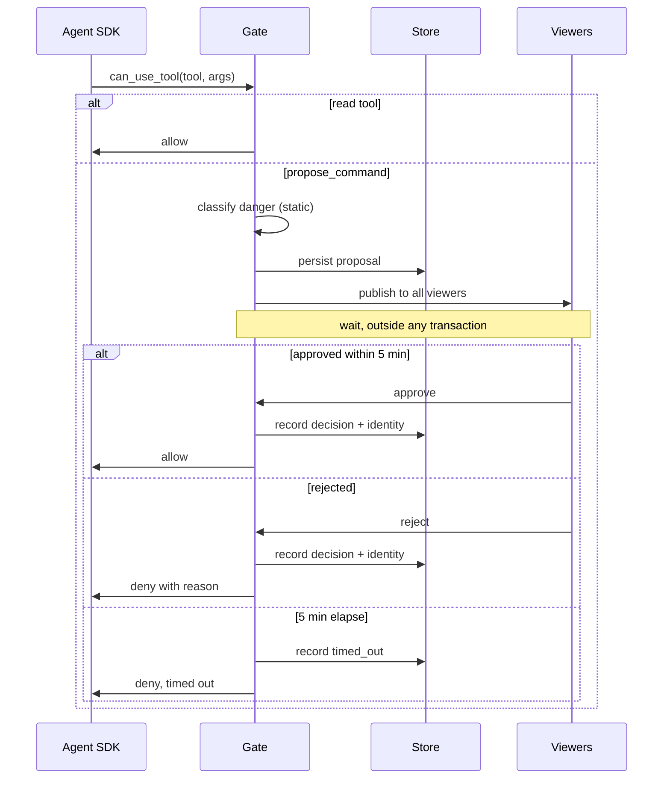

# Session orchestration and the approval gate — module design

This module owns the agent: configuring it, running turns, persisting what happens, and enforcing
that no printer write occurs without a human approving it.

Requirements: [spec.md §5.2](../spec.md#52-session-lifecycle),
[§5.3](../spec.md#53-conversation), and [§5.5](../spec.md#55-printer-interaction). Components:
[architecture.md §3.2](../architecture.md#32-session-orchestrator) and
[§3.3](../architecture.md#33-approval-gate).

## 1. Scope

**In scope:** session lifecycle, agent configuration, the turn loop, message persistence, printer
binding, usage accounting, and the approval gate.

**Out of scope:** the UI that renders an approval ([web.md](web.md)) and the tools themselves
([file_indexing.md](file_indexing.md), [printer_access.md](printer_access.md)).

## 2. Design decisions

### 2.1 The gate is a permission callback, not application logic

The approval requirement is implemented as the Agent SDK's permission callback, invoked before any
tool the allowlist does not auto-approve.

This is the single most important structural choice in the system. A callback the SDK invokes
**sits below the model**: no prompt content, no tool description, and no instruction found in a
fetched web page can route around it, because the model never reaches the execution path without
passing through it. An application-level check that the model was asked to respect would be a
convention; this is a mechanism.

It is also what contains prompt injection from web content
([architecture.md §11](../architecture.md#11-security)). The containment is not that the model is
careful — it is that the path to the printer runs through a human.

### 2.2 Tool permissions are configured four ways

| Mechanism | Effect |
| --- | --- |
| Allowlist | Names only our MCP tools plus web search and fetch |
| Disallow list | Explicitly names the host-touching built-ins |
| Permission mode | Anything unlisted is denied rather than prompted |
| Permission callback | Gates the writes we do intend |

Redundant on purpose. The failure mode of getting this wrong is shell access on a host that sits on
the printer network, and four independent statements of the same intent means no single mistake
enables it.

Web search and fetch are allowed: diagnosis needs them, and they read rather than write
([decisions.md](../decisions.md)).

But "they never touch the host" is not the whole story. This host sits on the printer network, so
an unrestricted fetch could reach the printer's own HTTP API — `http://<printer>:7125/...` —
reading Moonraker directly, around the three-tier discipline and the gate, on a URL that may have
come from injected web content. **Web fetch is therefore restricted to public addresses**: loopback,
RFC-1918 private ranges, and link-local are refused, so a fetch cannot reach the printer or any
other LAN device. Whether the SDK enforces this itself or we must front it is an open question
([§9](#9-open-questions)).

### 2.3 Conversation is mirrored into the store

The SDK persists its own session state, and that is what makes resume cheap. It is not the record.
Every message, tool call, approval, and result is written to the store as it happens, because
[spec.md §10](../spec.md#10-data-and-persistence-requirements) requires all of it to survive a
restart and to be backed up and restored as one thing.

The SDK's store is a resumption cache. Ours is the truth.

### 2.4 One agent client per active session, none per idle session

A session with activity holds a client; an idle session holds nothing. Resuming re-creates the
client against the SDK's stored session, so a restart or an overnight gap costs a reconnect rather
than a lost conversation — which is exactly the shape
[spec.md §5.6](../spec.md#56-calibration-procedures) needs, where a procedure waits hours for a
test print and the user closes the browser.

## 3. Session lifecycle

- **Naming** is a model call on the opening content, stored and renameable at any time.
- **Binding** follows [spec.md §5.2](../spec.md#52-session-lifecycle): detected from the project's
  printer preset, nozzle diameter and printable area; silent on a confident match, prompted
  otherwise. Every binding writes a `printer_binding` row
  ([design/store.md §4.5](store.md#45-printer_binding)), so a reassignment cannot retroactively
  reattribute earlier findings.
- **Closed is not terminal.** A closed session remains readable and can be reopened, per the spec.
- **No deletion** in this version.

### 3.1 Printer mismatch is a finding

When the project's printer disagrees with the session's bound printer, that is raised as a
diagnostic finding rather than reconciled quietly
([spec.md §5.2](../spec.md#52-session-lifecycle)). Slicing for one machine and printing on another
has a characteristic signature — wrong nozzle diameter, wrong flow, geometry outside the build
volume — and it explains a whole class of defects.

## 4. Agent configuration

Per client, assembled at session start or resume:

| Setting | Value |
| --- | --- |
| Model | Configured; defaults to the current Opus model |
| Thinking | Adaptive |
| Effort | Configured |
| MCP servers | `project`, `gcode`, `printer`, in-process |
| Allowed tools | Those three servers' tools, plus web search and fetch |
| Disallowed tools | The host-touching built-ins |
| Permission mode | Deny anything unlisted |
| Permission callback | The approval gate |
| System prompt | Assembled per [§4.1](#41-system-prompt-assembly) |

### 4.1 System prompt assembly

Ordered **stable content first**, because the prefix is what caches
([architecture.md §6.1](../architecture.md#61-claude-agent-sdk)):

1. Role, method, and the diagnostic principles — identical across all sessions.
2. The procedure catalog ([procedures.md](procedures.md)) — changes only when procedures change.
3. Shared knowledge-base context — slicer conventions, materials, and filament storage conditions.
4. The bound printer's raw section text and newest configuration snapshot.
5. Session-specific state — what is uploaded, what is indexed, what is known so far.

Items 1 and 2 are identical across every session, so they cache across sessions and not merely
within one. Item 5 changes every turn and therefore sits last.

The prompt also carries the rules that are policy rather than mechanism: cite web-derived claims
and rank them below first-hand evidence; distinguish established from hypothesised; judge photo
quality and ask for a better one rather than guessing; never present a snapshot value as runtime
state.

## 5. The turn loop

1. Input arrives — text, transcribed audio, or a message with images.
2. The message is persisted, then handed to the client.
3. The SDK streams thinking, text, and tool calls back. Text is forwarded to subscribed viewers as
   it arrives.
4. Tool calls execute in-process. Reads proceed; `propose_command` diverts to the gate.
5. Each message, tool call, and result is persisted as it completes.
6. Usage from the turn is accumulated onto the session.
7. The turn ends.

**A tool call is persisted when it starts, with a null completion time**, and updated when it
finishes. That is what makes an interrupted process recognisable: calls left with no completion
time are marked interrupted at next startup rather than assumed to have succeeded
([design/store.md §11](store.md#11-failure-handling)).

## 6. The approval gate

### 6.1 Rules

- **The exact command is what is shown and what is stored.** The approval row keeps the proposed
  command verbatim, so the audit trail records what the user actually saw rather than something
  re-derived later by formatting code that may since have changed
  ([design/store.md §4.8](store.md#48-approval)).
- **One approval per proposal.** Enforced by a uniqueness constraint in the schema, so
  double-approval is impossible rather than unlikely.
- **A timeout is a denial with a cause**, recorded as `timed_out`. Five minutes: long enough to
  walk to the printer and look before deciding, short enough that a forgotten proposal does not
  sit armed. A user who walks away never leaves a command waiting to fire.
- **Blocking is per turn, not per process.** Other sessions proceed. The wait is an awaited future
  holding no locks and no open transaction.
- **Any viewer may decide.** With multiple devices watching one session, the phone in your hand at
  the printer can approve what the desktop proposed. The deciding identity is recorded.
- **A denial returns a message the model can read**, so it can revise rather than simply fail.

### 6.2 What the gate does not do

It does not decide whether a command is a good idea. Danger classification is static and lives in
[printer_access.md §6](printer_access.md#6-danger-classification); the gate surfaces those flags
and asks a human. Keeping judgement out of the gate is what keeps it small enough to verify.

## 7. Failure handling

| Failure | Behaviour |
| --- | --- |
| Model API error mid-turn | Turn fails with the error surfaced; conversation intact; retryable |
| Tool raises | Recorded as an errored call; returned to the model, which may adapt |
| Process dies with a proposal pending | On restart it is recorded timed out, never approved |
| Process dies mid-turn | Incomplete tool calls marked interrupted; session resumable |
| SDK session cannot be resumed | Conversation replayed from the store into a fresh client |
| Printer unreachable when a write is approved | Reported; recorded as approved-but-not-executed |
| Store write fails mid-turn | Fatal for the turn; better to fail loudly than continue unrecorded |

The pending-proposal case is the one with teeth: **the failure direction is always denial**. A
crash must never resolve to an approval.

## 8. Testing

- **Gate tests are the priority.** Every path — allow, reject, timeout, crash-while-pending, and
  double-approval — has a test, because this is the component whose failure means an unapproved
  command reaches a machine with heaters.
- **A test proves the gate cannot be bypassed by prompt content**: a session whose input contains
  instructions to skip confirmation still stops at the gate. This is a regression test for the
  property the whole security argument rests on.
- **A test proves web fetch cannot reach the LAN**: a fetch aimed at a loopback, private, or
  link-local address is refused, so the printer's HTTP API is not reachable around the gate.
- **Agent SDK interaction is tested against the real SDK** with a stub model transport. Faking the
  SDK would mean reproducing its permission and streaming semantics — the exact behaviours under
  test — which would be a re-implementation.
- **Session resume is tested across a process restart**, asserting the conversation is complete
  and that a mid-flight tool call is marked interrupted.
- **Binding is tested for all four cases**: confident match, ambiguous, no match, no project file;
  plus reassignment, asserting the history row.
- **Prompt assembly is tested for stable ordering**, asserting the prefix is byte-identical across
  two sessions with different printers up to the point where they diverge.
- **Timeout is tested with an injected clock**, not by sleeping.

## 9. Open questions

1. **Effort level default.** Effort is a single configured level per session, not varied per turn:
   adaptive thinking ([§4](#4-agent-configuration)) already scales deliberation within a turn, and
   choosing effort per turn would need a difficulty estimate before the turn runs that the input
   does not reliably give ("this photo looks fine" can become a deep diagnosis). Open is only the
   default level, which needs real usage — diagnosis benefits from deliberation, a quick lookup does
   not — to settle.
2. **Whether idle clients should be released immediately or after a grace period.** Release is
   cheap and safe either way — the conversation is mirrored to the store
   ([§2.3](#23-conversation-is-mirrored-into-the-store)) — so a grace period buys only the latency
   of one avoided reconnect during a normal back-and-forth pause. The decision hinges on the
   measured resume latency against the SDK:
   negligible favours immediate release for its simplicity, a couple of seconds favours a short
   grace period. Unblocked by that one measurement.
3. **Replay-on-resume-failure fidelity.** Rebuilding a client from stored messages is
   straightforward for text and images; whether thinking blocks and tool results replay cleanly
   into a fresh SDK client needs testing against the SDK. The degradation rule is pinned: replay
   must preserve the conversation's meaning — text, images, tool calls and their results, the
   actual findings — and may drop reconstruction-only elements the SDK will not accept, such as
   thinking blocks, which are the model's scratch work and not part of the record. So the fallback
   is guaranteed to work even if fidelity is imperfect; open is only which elements survive intact.
4. **Whether web fetch's address restriction is enforced by the SDK or by us.** Web fetch must
   refuse loopback, private, and link-local addresses so it cannot reach the printer LAN
   ([§2.2](#22-tool-permissions-are-configured-four-ways)). Whether the Agent SDK's fetch tool
   already enforces this, exposes a hook for it, or must be fronted by our own fetch proxy is
   confirmed against the SDK at implementation.

## 10. Implementation tasks

- [x] **T3.1** Session lifecycle: create, name, rename, close, reopen, list.
- [x] **T3.2** Printer binding: detection from project identity, prompting, reassignment with
      history, mismatch as a finding.
- [x] **T4.1** Agent client configuration, including all four permission mechanisms, wired
      end-to-end: per-session in-process MCP servers, `build_prompt`, and the `approve` bridge to
      the gate ([composition.py]).
- [x] **T4.2** System prompt assembly with stable-first ordering.
- [ ] **T4.3** Web-fetch address restriction: refuse loopback, private, and link-local addresses,
      by SDK configuration or a fetch proxy, so it cannot reach the printer LAN.
- [x] **T5.1** Turn loop: streaming, incremental persistence, usage accumulation.
- [x] **T5.2** Interrupted-call sweep at startup.
- [x] **T6.1** The approval gate: classification handoff, persistence, publication, awaited
      decision, recording.
- [x] **T6.2** Timeout handling with an injectable clock.
- [x] **T6.3** Crash-safety: pending proposals resolve to denial on restart.
- [ ] **T7.1** Client lifecycle: release on idle, resume on return, replay when resume fails. The
      resume seam is wired (`resume_lookup` reads the stored `sdk_session_id`); idle release and
      replay-on-resume-failure remain, needing the live SDK to settle their fidelity.
