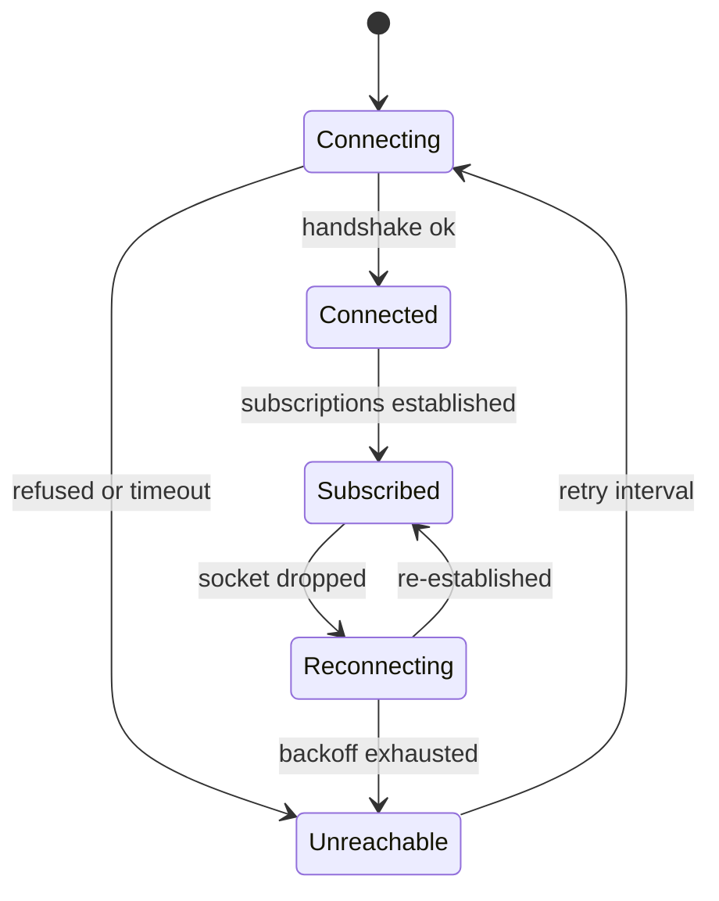

# Printer access — module design

This module is everything that touches a printer: reading its state, snapshotting its
configuration, capturing stills, submitting commands, and stopping it.

Requirements: [spec.md §5.5](../spec.md#55-printer-interaction) and
[spec.md §8](../spec.md#8-printer-access-requirements). Component:
[architecture.md §3.6](../architecture.md#36-printer-client).

## 1. Scope

**In scope:** the Moonraker client, connection lifecycle, the three-tier state distinction, the
`printer` MCP tools, webcam capture, and emergency stop.

**Out of scope:** deciding whether a command should run. This module submits what it is given; the
approval gate decides ([orchestration.md](orchestration.md)). The separation is deliberate — a
module that both decides and executes is one where the decision can be skipped.

## 2. Design decisions

### 2.1 Persistent connections, one per printer

A WebSocket is held to each reachable printer for the process lifetime, reconnecting with backoff
on drop. Three things follow that on-demand connections would not give:

- **Live state is already current** when a session asks, rather than paying connection latency on
  every first query.
- **Reachability is known before a session asks**, so the UI can say a printer is offline instead
  of discovering it mid-conversation.
- **Print progress and failures are observable**, which is what makes a procedure waiting on a
  physical print able to see the print finish at all.

HTTP is used alongside for one-shot queries and command submission; the WebSocket carries
subscriptions.

### 2.2 The three tiers are separate types

[spec.md §5.5](../spec.md#55-printer-interaction) requires configured values, saved values, and
runtime state never to be conflated. This is enforced in the return types, not by convention:
each is a distinct structure carrying its source and read time, and there is no accessor that
returns "the value" without saying which kind it is.

The consequence that matters: **runtime state has no stored fallback**. When the printer is
unreachable, a runtime query returns unavailable-with-reason. It never substitutes a saved value,
because the saved bed mesh and the mesh actually in effect are different claims and a printer that
re-meshes before every print makes them routinely different
([spec.md §5.1](../spec.md#51-printer-management)).

### 2.3 Emergency stop is `M112` and bypasses everything

The emergency stop issues Klipper's `M112`: heaters off, motion halted, MCU into shutdown,
recovery requiring a firmware restart.

Two properties are required of it and neither is negotiable. It **bypasses the agent and the
approval gate entirely** — it is a direct call from the web layer to this module, so it works when
the model is mid-turn, wedged, or unreachable. And it **bypasses the normal command path** by
using Moonraker's dedicated emergency-stop endpoint (`POST /printer/emergency_stop`, the
`printer.emergency_stop` RPC), which shuts the MCU down directly rather than submitting `M112` as a
gcode script that could sit behind a pending command in the queue.

`M112` rather than a graceful cancel because it matches the stop button in Mainsail. Someone
reaching for a stop button in this system gets what they would get reaching for it in the
interface they already use, and there is no moment of wondering which kind of stop this one was.
The cost — a lost print and a firmware restart — is the correct trade when the button is pressed.

**Recovery is out of scope for this version.** Clearing the Klipper shutdown after the stop needs a
`FIRMWARE_RESTART`, which the user issues from Mainsail; this system does not offer a restart
control. A one-tap restart in its own UI is future work ([spec.md §14](../spec.md#14-future-work)).

## 3. Connection lifecycle

- **Startup probes every printer** and records reachability without blocking startup
  ([architecture.md §5.5](../architecture.md#55-startup)).
- **Unreachable is a normal state**, not an exception. It is reported through return values;
  nothing propagates an exception into a session because a printer is off.
- **Reconnection uses exponential backoff with a ceiling**, and an unreachable printer is retried
  indefinitely at that ceiling — printers get switched off and on again.
- **State cached from a subscription is timestamped and marked stale on disconnect.** A cached
  value from before a drop is not presented as current.

## 4. The three tiers

| Tier | Source | Available when unreachable | Examples |
| --- | --- | --- | --- |
| Configured | Config files, snapshotted | Yes, from snapshot | Kinematics, limits, pins |
| Saved | `SAVE_CONFIG`, snapshotted | Yes, from snapshot | PID, probe calibration, mesh profiles |
| Runtime | Live from the machine | **No** | Mesh in effect, applied Z offset, tilt, live values |

Runtime state includes, per [spec.md §5.5](../spec.md#55-printer-interaction):

- **The bed mesh currently loaded**, with its probed points. On a printer that re-meshes before
  every print this exists only in the running firmware and is never written to saved config.
- **The Z offset actually applied**, including live adjustment during a print.
- **The current gantry or bed tilt correction** from `z_tilt_adjust` or `quad_gantry_level`.
- **Anything set at runtime** by a macro or the operator: shaper parameters, pressure advance,
  flow multiplier, speed and extrusion factors.

**Captured runtime state is stored as an artifact** when a session records it
([design/store.md §4.9](store.md#49-artifact)), which is the only way a mesh survives the next
print's re-mesh and the only way a cloud-mode review can see it at all.

## 5. MCP tools

| Tool | Tier | Returns |
| --- | --- | --- |
| `get_status` | Runtime | Idle, printing, paused, error; current file and progress |
| `get_temperatures` | Runtime | Hotend, bed, chamber; actual and target; fan speeds |
| `get_position` | Runtime | Position, homing state, active offsets |
| `get_config` | Configured + saved | Running configuration, tiers distinguished |
| `get_runtime_state` | Runtime | Mesh, applied offsets, tilt, runtime-set values |
| `get_logs` | Runtime | Recent log output and any active error text |
| `capture_still` | Runtime | A webcam frame, stored as an artifact |
| `propose_command` | — | **The only write.** Submits to the approval gate |

`get_logs` earns its place: the text of an active Klipper error is frequently the single most
informative thing about a failed print, and it is not derivable from anything else.

### 5.1 `propose_command`

The model calls this with the command and its intent. The tool does not execute — it hands the
proposal to the gate and returns the gate's outcome, which is one of executed-with-result,
rejected-by-user, or timed-out. A rejection returns a message the model can read and respond to.

Before the gate sees it, the command is **classified statically** for danger, independent of what
the model said about it ([§6](#6-danger-classification)).

## 6. Danger classification

A static check on the pending command, run in this module so it does not depend on the model's
description of its own request. Per [spec.md §5.5](../spec.md#55-printer-interaction):

| Condition | Detection |
| --- | --- |
| Movement without homing | Motion command while homing state is not complete |
| Beyond configured limits | Target coordinate outside the axis limits in the configuration |
| Extrusion below safe temperature | Extrusion command with hotend below the configured minimum |
| Heater safety parameters | Command touching `max_temp`, `min_temp`, or verify-heater settings |
| Unknown effect | Neither a categorised command nor a macro defined in the config snapshot |

**Macros are expanded before classification.** Most of what a procedure runs is a Klipper
macro — `SHAPER_CALIBRATE`, `PID_CALIBRATE`, `QUAD_GANTRY_LEVEL`, and the user's own — whose name
carries no meaning to a name-based check. A macro is a gcode template in the configured tier
([§4](#4-the-three-tiers)), so the classifier resolves a called macro to its body from the config
snapshot, following nested calls, and classifies the underlying moves and heater commands. A macro
is therefore not unknown merely because its name is unfamiliar; it is judged by what it expands to.

The first four are flagged prominently in the confirmation. **The last is refused outright**:
[spec.md §5.5](../spec.md#55-printer-interaction) requires the system not to propose actions whose
effect it cannot describe, and a command that is neither a categorised command nor a macro defined
in the snapshot is exactly that. Refusal returns a message the model can respond to by proposing
something recognised.

## 7. Webcam capture

Stills come from crowsnest's snapshot endpoint. Every capture is stored as an artifact and kept —
a still is tens to hundreds of kilobytes against G-code files in the hundreds of megabytes, which
makes it noise in the storage budget, and keeping all of them means a session's visual record is
complete when reviewed months later.

A printer with no camera reports the capability as absent rather than erroring on each attempt.

## 8. Failure handling

| Failure | Behaviour |
| --- | --- |
| Printer unreachable | Live tools unavailable with reason; configured and saved from snapshot |
| Connection drops mid-session | Reported; cached state marked stale; reconnection begins |
| Drops after a command is submitted | Reported; the command is **not** assumed to have run |
| Moonraker returns an error | Surfaced verbatim; Klipper's error text is diagnostic content |
| Command rejected by Klipper | Recorded as an executed proposal with an error result |
| Webcam unavailable | Capability reported absent; other tools unaffected |
| Printer requires authentication | Reported as unreachable with that specific reason |
| Emergency stop fails to send | Reported immediately and unmistakably; never silently swallowed |

The mid-command drop is the one that matters most. The honest answer — "the connection dropped
after this was sent; I do not know whether it ran" — is the only safe one, and the system says it
rather than guessing either way.

## 9. Testing

- **A fake Moonraker is not acceptable for behavioural tests.** Reproducing its state model,
  subscription semantics, and error shapes accurately enough for the tests to mean anything would
  be a re-implementation that drifts. Behavioural tests run against a real Klipper instance —
  a virtual one is sufficient and needs no hardware.
- **Protocol-level tests** for message framing, subscription handling, and reconnection use a
  minimal socket server, since those are properties of the transport rather than of Klipper.
- **The three-tier separation is tested by type**: a test proves no path returns a runtime value
  from a snapshot, including when the printer is unreachable.
- **Every danger classification gets a test**, including the unknown-command refusal and a macro
  that expands to a flagged command being classified by its body, not waved through by name.
- **The mid-command drop is tested** by dropping the connection after submission, asserting the
  result reports uncertainty rather than success or failure.
- **Emergency stop is tested for bypass**: it works while a command is pending approval, and while
  the agent is mid-turn.
- **Connection failures are injected** through a module-level function variable, never by
  environment manipulation.

## 10. Open questions

1. **Which Moonraker subscriptions to hold.** The principle is settled: subscribe only to what
   must be observed continuously — reachability, print progress and failure, live temperatures
   ([§2.1](#21-persistent-connections-one-per-printer)) — and fetch everything else over HTTP on
   demand. A field outside the subscription set is therefore not missing, just pulled when a tool
   asks, so a narrow set degrades to a fetch rather than an error. Open is the exact set of objects
   to subscribe to, which needs measuring the update volume against a printing machine.
2. **Log retrieval volume.** `get_logs` answers two needs that bound differently. The active error
   text — Klipper's current shutdown or error message — is small and always the most informative
   thing about a failure ([§5](#5-mcp-tools)), so it is always returned. The rolling `klippy.log`
   is large (tens of MB) and is served as a bounded, widenable tail, the same discipline as
   `gcode.get_commands`, never whole. Open is only the default window size — how much recent log
   diagnoses without paging — which needs a look at a real log during a failure.

## 11. Implementation tasks

- [ ] **T3.1** Moonraker client: HTTP queries, WebSocket subscriptions, connection lifecycle with
      backoff.
- [ ] **T3.2** Startup probe and reachability tracking.
- [ ] **T4.1** Three-tier state types, with source and read time, and the no-fallback rule.
- [ ] **T4.2** Runtime state retrieval: mesh with probed points, applied offsets, tilt, runtime
      values.
- [ ] **T4.3** Runtime state capture as an artifact.
- [ ] **T5.1** Read MCP tools: status, temperatures, position, config, runtime state, logs.
- [ ] **T6.1** Danger classifier, with macro expansion from the config snapshot and the
      unknown-command refusal.
- [ ] **T5.2** `propose_command` and its handoff to the approval gate.
- [ ] **T7.1** Webcam capture and artifact storage; absent-capability reporting.
- [ ] **T2.1** Emergency stop: `M112`, bypassing the agent, the gate, and any queue.
