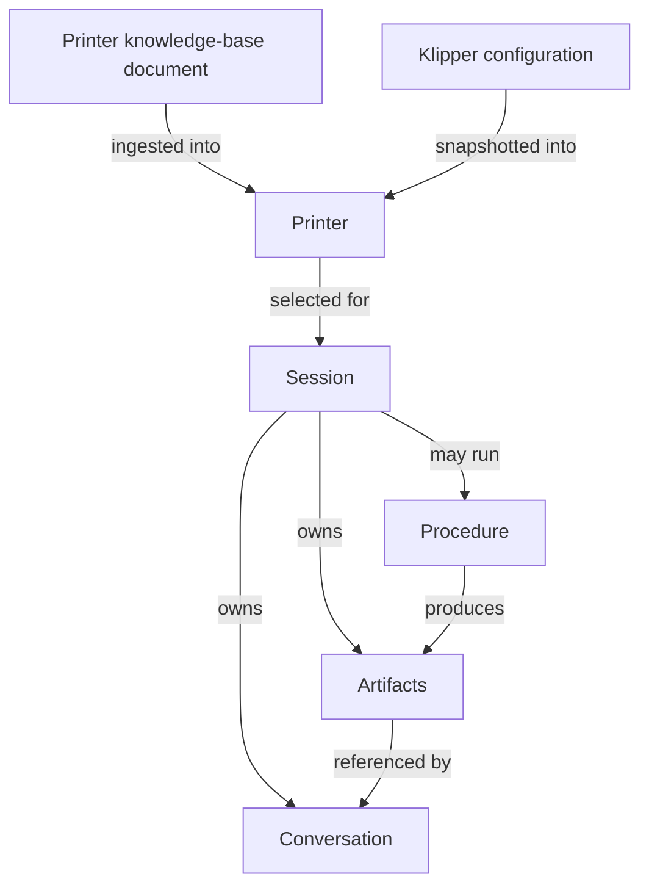

# 3D Printer Debugger — Product Specification

Status: draft, pending review.
Related documents: [decisions.md](decisions.md).

This document defines *what* the system must do. It deliberately makes no technology choices —
language, framework, datastore, transcription provider, and deployment mechanics are decided in
the architecture document that follows this one.

---

## 1. Purpose and goals

The 3D Printer Debugger is an assistant that helps a 3D printer owner get better prints. It
does two related jobs:

- **Calibration** — guide the user through calibrating their printer and their filament
  settings, running the procedures on the machine where possible and interpreting the results.
- **Debugging** — diagnose a specific print quality problem by combining what the user
  observed (described in words, shown in photos), what the slicer was told to do, what the
  G-code actually contains, and what the printer reports about itself.

Goals:

1. Give the user a concrete, actionable answer to "why does this print look like this, and what
   do I change?" rather than a list of generic possibilities.
2. Make calibration something the user can be walked through end to end, from the phone in
   their hand while standing at the printer.
3. Ground every answer in the actual artifacts — the real slicer project, the real G-code, the
   real printer configuration and state — not in guesses about a generic printer.
4. Keep a durable record: each investigation is a named session that can be revisited, resumed,
   and referred back to when the problem recurs.

Success looks like: the user starts a session from their phone, photographs a defect, hands the
system the project file, answers a few questions, and leaves with either a fix applied to the
printer (with their approval) or a specific list of settings to change.

Non-goals for this version are listed in [§2](#2-scope) and [§14](#14-future-work).

## 2. Scope

### In scope

- A single logical user (see [§11](#11-security-and-privacy-requirements) for how several
  identities can map to that one user).
- Multiple printers, defined by ingesting an externally maintained knowledge-base document.
- Multiple concurrent, named, resumable sessions, each covering one problem or one calibration.
- Text input, voice input, and image input from a phone or desktop browser.
- Ingestion of an OrcaSlicer `.3mf` project and, optionally, a G-code file per session.
- Reading printer state and configuration from Klipper via Moonraker, when the system runs on
  the printers' network.
- Executing G-code and macros on the printer, each action individually confirmed by the user.
- A small catalog of structured calibration procedures, with freeform reasoning outside it.
- Web search and page retrieval, so diagnosis can draw on firmware, slicer, vendor, and community
  knowledge rather than only on the model's training data.
- Running unchanged both locally on the user's computer and on a public cloud, GCP first.

### Out of scope for this version

- Reaching printers from a cloud deployment (no relay, no tunnel, no VPN assumptions).
- Moonraker authentication; unauthenticated access on a trusted LAN is assumed.
- Creating or editing printer definitions inside the application.
- Deleting sessions.
- Slicers other than OrcaSlicer; printer firmware other than Klipper.
- Video and timelapse analysis.
- System-owned filament profiles or writing profiles back into the slicer.
- Multiple isolated users with separate data.
- Any form of unattended or automated printer control.

Each of these is recorded in [§14](#14-future-work). Scope boundaries in this section are firm:
work outside them does not belong in this version even when it appears convenient.

## 3. Personas and usage contexts

There is one user: the owner and operator of the printers, technically competent, familiar with
Klipper and their slicer. Two contexts matter, and the system must serve both equally:

- **At the printer, on a phone.** The user is standing in front of the machine, possibly mid
  print. They want to photograph what they see, describe it out loud, and get an answer.
  Screen is small; typing is awkward; the camera and microphone are the primary inputs.
- **At a desk, on a computer.** The user is uploading project and G-code files, reading longer
  explanations, and reviewing what earlier sessions concluded.

A session started in one context must be seamlessly continuable in the other.

## 4. Core concepts

### Printer

A machine the user owns. A printer carries:

- An identity (a name, matching the hostname used to reach it).
- The section of the ingested knowledge-base document that describes it: hardware inventory,
  kinematics, build volume, toolhead, probe, bed surface, known problems, planned changes, and
  when each calibration was last run.
- A snapshot of its Klipper configuration, taken from local files or fetched from the printer.
- Connection information sufficient to reach Moonraker when on the same network.

Printers are ingested, never authored in the application ([§5.1](#51-printer-management)). A
worked example of the document they are ingested from is in
[examples/printer_definition.md](examples/printer_definition.md).

### Filament and material context

The material a print was made with, together with its slicer settings, is read out of the
uploaded project for the session in question. It is a property of the artifacts, not an object
the system owns or maintains ([§5.8](#58-output-and-recommendations)).

### Session

One investigation: a single print quality problem being debugged, or a single calibration being
performed. A session owns its conversation, its uploaded and captured artifacts, the printer it
concerns, and any procedure runs and their results. Sessions are named automatically by the
model from their opening content, renameable by the user, listable, and resumable at any later
time ([§5.2](#52-session-lifecycle)).

### Artifact

Anything attached to a session that is too large, too binary, or too visual to live in the
conversation itself: the `.3mf` project, a G-code file, photos taken with the phone camera or
uploaded, webcam stills pulled from the printer, and the outputs of procedure runs such as
resonance graphs or measured values.

### Procedure

A catalog entry describing a calibration: its purpose, its preconditions, the steps to perform,
the printer commands each step issues, what output to collect, and how to interpret it
([§5.6](#56-calibration-procedures)).

## 5. Functional requirements

### 5.1 Printer management

- The system must ingest printer definitions from an externally maintained markdown
  knowledge-base document: one section per printer, free-form prose and bullet lists,
  containing hardware details, known problems, planned changes, and calibration status. See
  [examples/printer_definition.md](examples/printer_definition.md) for a worked example of such
  a document and of the detail level the system expects.
- Only three things must be reliably locatable within each printer's section: the printer's
  name, an address at which it can be reached, and a pointer to its Klipper configuration files
  where those exist locally. Everything else is context to be read, not fields to be parsed.
- **The document has no schema and the system must not impose one.** Ingestion splits the
  document into per-printer sections and uses the model to extract the three required values
  from each; it does not pattern-match field names or require a fixed layout. The user writes
  the document however they find useful, and the system adapts to it rather than the reverse.
- The extracted values must be cached and re-derived only when the document changes, so normal
  operation does not repeat the extraction.
- Each printer's section must also be retained verbatim. The extracted values exist for
  connecting to the machine; the prose is what the model reasons from during a session, and
  summarising it away would discard exactly the detail that makes diagnosis specific.
- When a required value cannot be found for a printer — no address, or a configuration path
  that does not resolve — the system must tell the user precisely what is missing from which
  section and ask them to correct the document. If the user chooses not to, that printer stays
  usable in a degraded form, with the system stating plainly which capabilities are unavailable
  as a result. A problem with one printer must never block the others or fail the whole ingest.
- The location of that document must be configurable.
- The system must detect that the document has changed and re-ingest it, so hand edits by the
  user take effect without reinstalling or resetting anything.
- The document may reference the location of the printer's Klipper configuration files. When
  those paths are readable locally, the system must import the configuration from them.
- When the printer is reachable over Moonraker, the system must be able to fetch the live
  configuration from the printer instead, including values Klipper itself saved (the
  `SAVE_CONFIG` block), which are frequently the values actually in effect.
- **Configuration sources have a fixed precedence.** When the printer is reachable, the live
  configuration read from it — including the values Klipper saved itself — is authoritative.
  When it is not, the stored snapshot of the local configuration files takes over. The
  knowledge-base document is never authoritative for a value: it is context written by hand, it
  is allowed to be out of date, and the system must not quote a number from it as the machine's
  current setting.
- The reason for that order is that the machine is the only source that reflects what is
  actually running. Configuration files record intent, and Klipper routinely supersedes them —
  a PID value commented out in a source file while a different one lives in `SAVE_CONFIG` is
  the normal case, not a pathological one.
- Every value the system reports must carry its provenance: which source it came from, and when
  that source was read.
- The system must detect disagreements between the sources during ingestion and record them.
  It must not announce them all as a matter of course — a document with known stale comments
  would generate the same noise on every run. It must raise a discrepancy when that particular
  value bears on the question being discussed, and must be able to produce the full list on
  request as a configuration audit.
- Imported configuration must be stored as a snapshot associated with the printer, so that a
  deployment with no printer access still has an accurate picture of the machine.
- A configuration snapshot captures the machine's configured and saved values only. It does not
  and cannot capture runtime state — most importantly the bed mesh actually in effect, which on
  a printer that re-meshes before every print exists only in the running firmware
  ([§5.5](#55-printer-interaction)). The system must not present snapshot data as though it
  described what was in effect during a particular print.
- The system must record when each snapshot was taken and must tell the user when it is
  reasoning from a stale snapshot rather than live data.
- The system must not create, edit, or delete printer definitions. The knowledge-base document
  is the user's to maintain. Where the system learns something that belongs in that document —
  for example that a calibration was just run — it must surface that as a suggested edit for
  the user to apply, not apply it itself.
- The system must handle more than one printer. Every session is associated with exactly one of
  them, identified as described in [§5.2](#52-session-lifecycle).

### 5.2 Session lifecycle

- The user must be able to create a session at any time.
- Every session must have a name. The name must be chosen automatically by the model from the
  session's opening content, and must be descriptive enough to identify the session later.
- **A session concerns exactly one printer, and the system determines which one rather than
  making the user state it.** The uploaded project records the printer preset it was sliced
  with, along with the nozzle diameter, printable area, and machine limits
  ([§7](#7-large-file-access-requirements)). The system must use these to identify the printer
  and match it against the ingested printer definitions.
- The preset name in the project and the printer's name in the knowledge-base document are
  written by hand and will not always agree, so the match cannot rest on the name alone. Nozzle
  diameter and build volume are corroborating evidence and are usually decisive across
  dissimilar machines; they are not decisive between two similar ones.
- On a confident match the session binds to that printer without asking. When the evidence is
  ambiguous, when nothing matches, or when the session begins without a project file, the
  system must ask the user which printer this concerns.
- The bound printer must be changeable afterwards, since detection can be wrong and a problem
  can turn out to be on the other machine. A reassignment must be recorded in the session, so
  findings established before it are not silently reattributed.
- **A disagreement between the project's printer and the session's printer is a finding, not a
  detail to reconcile quietly.** Slicing for one machine and printing on another is a real
  mistake with a characteristic signature — wrong nozzle diameter, wrong flow, geometry outside
  the build volume, machine limits the printer does not have — and it explains a whole class of
  defects. The system must raise it.
- The user must be able to rename any session at any time.
- The user must be able to list existing sessions, see enough of each to recognise it (name,
  printer, when it was last active, current state), and open any of them.
- Opening an existing session must restore its full conversation and artifacts and allow the
  conversation to continue.
- Multiple sessions must be able to exist concurrently. Work in one must not affect another.
- A session must be markable as closed or resolved, and a closed session must remain readable
  and resumable.
- Each session concerns exactly one problem or one calibration. When a conversation clearly
  moves to a different problem, the system must offer to start a new session rather than
  silently mixing concerns.
- Session deletion is not in this version ([§14](#14-future-work)).

### 5.3 Conversation

- The user must be able to send messages as text.
- The user must be able to send messages as voice: the browser captures audio, the system
  transcribes it server-side, and the transcript enters the conversation as the user's message.
- The transcript must be visible to the user, so a mis-transcription is obvious and correctable.
- A single voice message is capped at **two minutes by default, configurable**. Describing a
  problem out loud takes well under that; the cap bounds upload size and transcription latency
  on a phone connection, and stops a forgotten open microphone from becoming a large upload.
- On reaching the cap, recording stops, the audio captured so far is transcribed and submitted,
  and the user is told it was cut short so they can continue in a second message. Speech the
  user has already given must never be discarded.
- Transcription must be resilient to the conditions it will actually be used in: a noisy
  workshop, a running printer, and the vocabulary of this domain. When the service fails or
  returns nothing usable, the system must say so and leave the user able to type instead,
  rather than submitting an empty or garbled message as though it were what was said.
- The user must be able to attach images to a message, both freshly captured and previously
  taken.
- The assistant's responses must be able to reference artifacts in the session and to show
  images back to the user (for example, a specific webcam still or resonance graph).
- The conversation must be streamed or otherwise incrementally displayed, so a long answer does
  not look like a hang ([§12](#12-non-functional-requirements)).
- The conversation must survive a page reload, a network drop, and a switch between devices.

### 5.4 File ingestion

- A session must accept one OrcaSlicer `.3mf` project file. This is the normal starting point
  for a debugging session.
- A session must additionally accept a G-code file when the problem requires it. Two distinct
  questions need it: what the slicer actually emitted, as opposed to what it was configured to
  emit; and what the printer was specifically doing at the moment and place a visible defect
  was produced ([§5.7](#57-diagnosis)).
- Uploads must work from both phone and desktop browsers, and must give visible progress, since
  these files are large and mobile uplinks are slow.
- The system must accept files of the sizes these formats reach in practice. The default limits
  are **500MB for a G-code file and 100MB for a `.3mf` project**, both configurable. A dense
  350mm plate at a fine layer height approaches 300MB of G-code, so these leave real headroom;
  the limit exists to catch a mistake — the wrong file, a corrupt upload — not to ration normal
  use.
- An oversized file must be rejected from its declared size before the transfer completes, with
  a message naming the actual size and the limit. Discovering the rejection at the end of a
  long upload over a phone connection is not acceptable.
- Uploaded files must be stored as session artifacts and remain available when the session is
  resumed later.
- Neither file type may ever be passed to the model in full. All access is through targeted
  extraction ([§7](#7-large-file-access-requirements)).
- The system must validate that an uploaded file is what it claims to be and must fail with a
  clear message rather than a parse error deep in a tool call.

### 5.5 Printer interaction

Read access, available only when the system can reach the printer:

- Current state: idle, printing, paused, or in error, and the current print's file and progress.
- Live temperatures and targets for the hotend, bed, and any chamber sensor, and fan speeds.
- Current position, homing state, and active offsets.
- The running configuration, including Klipper's saved values.
- **Runtime state that exists only in the running firmware and appears in no configuration
  file.** This is a distinct category and must be read live from the printer:
  - The bed mesh currently loaded and in effect, including its probed points. Where the user
    re-meshes before every print, this mesh is generated at print time and is never written to
    the saved configuration, so the saved profiles say nothing about what was actually in use
    for a given print. The same applies to any mesh loaded from a profile but then adjusted.
  - The Z offset actually applied, including any live adjustment made during a print, which is
    separate from the probe's configured offset.
  - The current gantry or bed tilt correction from `z_tilt_adjust` or `quad_gantry_level`.
  - Any value set at runtime by a macro or by the operator — shaper parameters, pressure
    advance, flow multiplier, speed and extrusion factors, active temperature offsets.
- Recent log output and the text of any active error state, which is often the single most
  informative thing about a failed print.
- A still image from the printer's webcam, captured on demand.

The distinction between these categories matters for diagnosis and must not be blurred: the
configuration says what the machine was told to do at startup, Klipper's saved values say what
calibration last established, and runtime state says what was actually in effect. For a printer
that meshes before every print, only the third answers "what was the bed compensation doing
when this first layer failed?"

Write access:

- The system must be able to propose executing G-code commands or macros on the printer.
- Every write action must be presented to the user before it happens, stating exactly what will
  be sent and what it will do, and must not execute until the user explicitly approves it.
- Approving one action must not implicitly approve any other. There is no "approve all".
- The user must be able to reject a proposed action and continue the conversation.
- Every executed action, its result, and the approval that authorised it must be recorded in
  the session.

Safety:

- The system must never execute a write action without an explicit, specific approval.
- The system must refuse to propose actions it cannot describe the effect of.
- Actions that risk damage — moving without homing, driving an axis beyond configured limits,
  extruding below the safe minimum temperature, changing heater safety parameters — must either
  be refused or be flagged prominently as dangerous in the confirmation.
- The user must have an always-available emergency stop that is not part of the conversation
  and does not require model involvement.
- If the printer becomes unreachable mid procedure, the system must report that plainly and
  must not assume the last requested action completed.

### 5.6 Calibration procedures

The system must ship a catalog of structured procedures. For this version the catalog is:

| Procedure | What it establishes | Scope of the result |
| --- | --- | --- |
| Input shaper | Resonance frequencies and shaper choice per axis | Printer |
| PID tuning | Bed and hotend heater PID values | Printer |
| First layer / Z-offset | Nozzle-to-bed distance and a clean first layer | Printer + filament |
| Pressure advance / flow | Pressure advance value and flow ratio | Printer + filament |
| Temperature tuning | Nozzle and bed temperatures | Printer + filament |
| Stringing / retraction | Retraction length and speed, travel behaviour | Printer + filament |

Requirements:

- **A calibration result is scoped to what it actually depends on, and that scope must be
  recorded with it.** Machine calibrations belong to the printer alone. **Every filament
  calibration, without exception, is scoped to a filament *on a specific printer*** — there is
  no such thing in this system as a filament value that holds across machines. The same spool
  tuned on a different printer yields different numbers, because the extruder, hotend, nozzle
  diameter, and cooling all differ. Temperature is the clearest case: a value that works on a
  0.4mm nozzle with one hotend is not the value for a 0.6mm high-flow nozzle on another
  machine, even with the identical spool. The same holds for pressure advance, flow ratio, and
  retraction. First layer is a mixed case: the mechanical Z-offset belongs to the printer, but
  everything else the procedure establishes — first-layer temperatures, speed, squish, cooling —
  is printer + filament and must be scoped that way.
- The system must never present a printer + filament result as though it applied to that
  filament generally, and must not carry such a result from one printer to another. It may
  point out that a value exists for the other printer, as a starting point to be re-tuned, but
  must label it as such.
- Where a session's recommendations depend on a filament, the system must be explicit about
  which filament and which printer they were established for, since the user's own record of
  them lives outside the system ([§5.8](#58-output-and-recommendations)).
- Each catalog entry must define its purpose, its preconditions, its steps, the printer
  commands each step issues, what evidence to collect (a value, a graph, a photo of a test
  print), and how to interpret that evidence.
- The system must check a procedure's preconditions before starting and must tell the user what
  is missing rather than failing partway — for example, that no accelerometer is configured, or
  that the printer is currently printing.
- The system must be able to recommend a procedure based on the printer's recorded calibration
  status and the problem under discussion.
- Procedures that involve printing a test object must tell the user what to print and how, and
  must then work from the user's photograph of the result.
- **A procedure run is not a tracked object with a lifecycle of its own; it lives in the
  conversation.** A test print takes hours, and the user will close the browser and come back.
  Resumption works because the conversation is complete and durable: the user returns, says the
  print is done, and the model picks up from the transcript. There is no run state to display,
  no progress to poll, and no separate thing to keep in sync with reality.
- This places a requirement on the conversation instead. A procedure must leave the transcript
  in a state that is unambiguous when read hours later — what was started, on which printer and
  filament, what the user was asked to do, and what evidence is expected next — because that
  text is the only record of where things stood.
- The system must not assume time has not passed. On resuming a session it must treat live
  printer state as current and anything recorded earlier as historical, and must not present a
  temperature or print status read hours ago as though it were now.
- Every command a procedure issues to the printer goes through the confirmation gate in
  [§5.5](#55-printer-interaction). A structured procedure is not an exemption.
- Results must be recorded in the session, and the system must produce a summary the user can
  paste into the printer's knowledge-base document to update its calibration status.
- For anything outside the catalog, the assistant must be able to reason freely and improvise a
  procedure, subject to the same safety and confirmation requirements.

### 5.7 Diagnosis

- The system must be able to analyse photographs of a print and identify visible defects.
- **The system must judge whether a photo is actually good enough to draw the conclusion it is
  being asked for, and say so when it is not.** Poor lighting, blur, motion, glare on a glossy
  surface, shadow, insufficient magnification, or a bad angle must be reported as a limitation
  of the evidence — naming the specific problem and what a usable photo would look like — not
  worked around by inferring the detail the image does not show. Surface finish, layer
  consistency, stringing, and under-extrusion are exactly the things a phone camera obscures,
  and a confident answer from an unreadable photo is worse than asking for another one.
- Where a photo supports some conclusions but not others, the system must say which. It may
  answer what the image genuinely shows while declining the rest, rather than treating the whole
  photo as usable or unusable.
- The system must correlate a defect against the slicer settings in the project, the relevant
  region of the G-code, the printer's configuration, and its live or last-known state.
- **Locating a defect in the G-code is a first-class capability.** A defect is visible at a
  particular place on a physical object, and the G-code is the record of exactly what the
  printer was told to do at that place. The system must be able to work from where the user
  says the defect is to the specific instructions executed there, and must be able to help the
  user establish that location when they can only describe it approximately. The user is
  holding a part, not a coordinate, so the system must support several routes from one to the
  other and must let them be combined:
  - **A measured height.** The user measures the defect above the bed with calipers or a ruler
    and gives it in millimetres; the system converts that to a layer using the file's layer
    table. The most precise route, and it needs nothing from the interface.
  - **A stated layer number**, when the user saw it happen — from the printer's display, the
    webcam, or watching the print.
  - **Conversational narrowing.** The model works the location out from landmarks the user can
    describe: just above a hole, where an overhang begins, the top third, the layer where the
    part changes cross-section. It must correlate those against the object's geometry and the
    feature transitions in the file rather than asking the user to be more precise than they
    can be.
  - **Matching the photo to the plate.** The user's photo is compared against the plate image
    for the print — the preview embedded in the project or G-code, or a webcam still of the bed
    — to establish which object on the plate the defect is on and which side or region of it.
    This gives the XY part of the answer, which a height alone cannot; the two combine into a
    full location.
- These routes are complementary and the system must be able to use them together: the plate
  match narrows to an object and a region, the height or layer number narrows to a Z, and the
  conversation resolves what is left. The system must state which location it settled on and
  how confident it is, so a wrong assumption is visible rather than buried in the analysis.
- Having located it, the system must be able to report what the printer was actually doing at
  that point: which feature was being printed (external perimeter, infill, bridge, support,
  overhang), the speeds, accelerations and extrusion rates in use, the retractions and travel
  moves nearby, the temperature and fan state then in effect, and whether that layer or region
  differs from its neighbours. Many defects — layer shifts, zits and blobs, under-extrusion
  after a long travel, a bridge that sagged, a single bad layer — are only explicable from this
  view, since the slicer settings alone describe intent rather than what was emitted.
- Where a defect has a position on the bed rather than a height — regional first-layer adhesion
  being the obvious case — the system must be able to correlate that position against the bed
  mesh that was actually in effect, the probed points nearest it, and the object's placement on
  the plate. A region that consistently prints badly despite automatic meshing is a question
  about the mesh's values at that region, which requires the live mesh, not a saved profile.
- The system must distinguish a defect caused by what was commanded from one caused by how the
  machine executed it. When the G-code at the defect location is unremarkable, that is itself
  evidence, and it should redirect the investigation towards mechanics, materials, or printer
  state rather than settings.
- The system must be able to ask the user for more evidence — a closer photo, a different
  angle, better light, a specific measurement, a webcam still — and to say why it needs it. The
  request must be actionable: what to change about the shot, not merely that the last one was
  inadequate. The user is standing at the printer holding the part and can retake it in
  seconds, which makes asking cheap and guessing indefensible.
- The system must distinguish what it has established from what it is hypothesising, and must
  not present an inference as a confirmed fact.
- When multiple causes are plausible, the system must propose the cheapest discriminating test
  rather than listing every possibility.
- The system must take the printer's recorded known problems into account: a printer with a
  documented recurring fault should not be diagnosed from scratch every time.
- **The system must be able to consult external sources.** Firmware documentation, slicer
  documentation, hardware vendor material, community forums, and issue trackers all carry
  knowledge this domain depends on: a specific Klipper error string, a known bug in a toolhead
  board's firmware, a documented quirk of a probe, a fix the community found last month. The
  model's own knowledge has a training cutoff and this hardware moves, so the system must be able
  to search the web and retrieve pages rather than relying only on what it already knows.
- **Information taken from an external source must be cited and ranked below first-hand
  evidence.** Anything drawn from the web must name where it came from and be presented as a
  community suggestion, explicitly subordinate to what the uploaded artifacts, the printer's
  configuration, and its live state actually show. A confident forum post must never outweigh
  the G-code in front of it. This is the same established-versus-hypothesised distinction
  required above, applied to a source that is easy to mistake for authority.
- External content is untrusted input. The system must not act on instructions found in a
  fetched page, and no external content may cause a printer action — every printer write remains
  behind the explicit confirmation required by [§5.5](#55-printer-interaction).

### 5.8 Output and recommendations

- The primary output is a written explanation and a specific list of changes.
- Setting changes must be given as concrete values against named slicer settings, for the user
  to apply themselves in OrcaSlicer.
- Any recommendation that came from a filament calibration must name both the filament and the
  printer it applies to ([§5.6](#56-calibration-procedures)). Since the system does not own
  filament profiles in this version, the user is the one filing these values away, and a value
  recorded without knowing which machine it came from is worse than no value at all.
- Printer configuration changes must be given as the exact configuration snippet or command,
  and applying them to the printer follows the confirmation rules in
  [§5.5](#55-printer-interaction).
- The system must not write to the user's slicer profiles or configuration files.
- Each session must be able to produce a summary of what was investigated, what was concluded,
  and what was changed, suitable for the user to keep or paste elsewhere.

## 6. Interface requirements

- The interface is a web application reached from a browser. There is no native app.
- It must work on current mobile Safari and mobile Chrome, and on desktop browsers.
- Layout must be usable on a phone held in one hand, in front of a printer.
- The user must be able to take a photo directly from the page using the device camera and
  attach it to the conversation, without leaving the browser or using a file manager.
- The user must be able to record audio from the page and submit it as a message.
- The interface must provide a session list and a session view, and moving between them must
  not lose in-progress input.
- Proposed printer actions must be presented as an explicit, unmistakable confirmation that
  states what will be sent and requires a deliberate action to approve.
- The emergency stop must be reachable at all times while a printer is connected.
- Long-running work — a file being ingested, a procedure running, the model thinking — must
  show that it is in progress.
- Errors must be shown to the user in plain language, including the case where the printer is
  unreachable.

This section states behaviour only. Visual design and frontend technology are architecture
concerns.

## 7. Large-file access requirements

`.3mf` and `.gcode` files must be exposed to the model through an MCP server that answers
narrow questions about them. The model must never receive a whole file.

From a `.3mf` project, the system must be able to extract:

- The print process settings: layer height, line widths, speeds, cooling, temperatures,
  retraction, infill, supports, seam and wall settings.
- The filament settings recorded in the project, including material type and temperatures.
- The printer settings recorded in the project, including nozzle diameter and build volume.
- Which of those settings differ from the preset they derive from, since a modified setting is
  far more interesting than a default one. An OrcaSlicer project does not record this set, and it
  names its presets without embedding them, so producing the set needs the external preset library
  as a baseline. Ingesting that library is future work ([§14](#14-future-work)); until then the
  system serves the resolved settings and the preset names.
- Per-object and per-modifier overrides, and object placement on the plate.
- Plate and model metadata, including object names and counts.
- The embedded preview thumbnails, and the plate layout in a form that can be shown to the user
  and compared against a photograph of the finished plate ([§5.7](#57-diagnosis)). Knowing
  which object on the plate a defect belongs to depends on this.
- **The intended geometry of each object — what it was supposed to look like.** The project
  contains the 3D model, and diagnosis depends on comparing that intended shape against a
  photograph of what actually printed: a layer shift, a missing feature, or a sagged overhang is
  a departure from the model, invisible in settings and G-code alone. The system must be able to
  present the intended geometry as rendered views from useful angles, and to report an object's
  measurements — bounding box, height, footprint, volume, overhang extents. The geometry must be
  exposed through these bounded views, never fed to the model wholesale.

From a G-code file, the system must be able to extract:

- The slicer header and the configuration block, which records the settings the file was sliced
  with.
- The total layer count and the Z height and line range of any given layer, and the reverse:
  the layer containing a given Z height, line number, or print-time offset.
- A summary of a layer or layer range: which features appear, speeds and flow rates used,
  extrusion totals.
- Temperature, fan, and other state-changing commands, and where they occur.
- The raw commands in a bounded window around a given layer, Z height, or line number.
- The commands that print a given region of a layer, selected by XY coordinates or bounding
  box, and which object and feature that region belongs to. This is what makes a defect the
  user points at on a physical part locatable in the file.
- The machine state in effect at any point in the file — nozzle and bed target temperatures,
  fan speed, feedrate and acceleration limits, pressure advance, flow multiplier, absolute or
  relative extrusion mode. This is cumulative: it is set by commands earlier in the file, not
  visible in the window around the point of interest, so it must be reconstructed by
  accumulating state rather than read off nearby lines.
- Retractions, travel moves, and Z hops in a given window, with their lengths and speeds, since
  these are what produce stringing, zits, and post-travel under-extrusion.
- Anomalies relative to surrounding layers: an unusual layer time, an isolated speed or
  temperature change, a layer whose extrusion total departs from its neighbours.
- The embedded thumbnails.

Cross-cutting requirements:

- Every extraction must return a bounded response. A request that would return too much must
  fail with guidance on how to narrow it, not truncate silently.
- Extraction must not require reading the entire file into memory for every request, and
  repeated queries against the same file must not repeat the whole parse.
- Extraction results must be traceable: the model must be able to tell the user where in the
  file something came from.
- Files that are malformed, truncated, or produced by a different slicer must produce a clear
  error naming the problem.

The tool surface, parameters, and implementation belong to the architecture and module design
documents.

## 8. Printer access requirements

- The MVP supports Klipper printers accessed through Moonraker over HTTP and WebSocket.
- Printer connection details come from the ingested knowledge-base document and configuration;
  the system must not require the user to re-enter what that document already states.
- The system must verify reachability before offering live features and must clearly indicate
  whether a printer is currently connected.
- When a printer is unreachable — which is always the case in a cloud deployment — the system
  must degrade gracefully: the session continues, uses the stored configuration snapshot, and
  states plainly that live data and printer actions are unavailable.
- Degrading gracefully includes being honest about what is now unanswerable. Runtime state
  ([§5.5](#55-printer-interaction)) has no snapshot equivalent, so questions that depend on it —
  the mesh in effect for a given print, the applied Z offset, the live tilt correction — must be
  declined with an explanation, never answered from configured or saved values as if those were
  the same thing.
- When live state is captured while investigating a problem, it must be stored with the session
  as an artifact. This is the only way a runtime value remains available once the print is over
  or the printer is out of reach, and it is what lets a session be reviewed later or continued
  from a cloud deployment.
- The system must not fail or hang because a printer is offline.
- Moonraker authentication is not supported in this version. The system assumes unauthenticated
  access to Moonraker from a trusted LAN, which is the normal configuration for a printer on a
  home network. A printer that requires authentication must be reported as unreachable with an
  explanation, not silently retried or half-supported ([§14](#14-future-work)).

## 9. Deployment requirements

- The same build of the system must run locally on the user's computer and on a public cloud,
  with no code differences between the two.
- The first cloud target is GCP, but no requirement may depend on a service unique to one cloud
  provider. Anything provider-specific must sit behind a boundary that another provider's
  equivalent can be substituted into.
- All deployment-varying configuration — where the knowledge-base document is, where artifacts
  are stored, which identity provider to use, which printers exist — must be supplied externally
  per deployment, not baked into code. The mechanism (a configuration file for non-secret
  settings, the environment for secrets) is an architecture concern; the requirement here is only
  that a deployment can set these without a code change.
- Running locally must require no cloud account, no cloud credentials, and no external
  infrastructure beyond the model API and the transcription service. In particular it must
  require no identity provider, since local mode is unauthenticated
  ([§11](#11-security-and-privacy-requirements)).
- The local deployment is the development environment; it must be startable with a single
  documented command.
- **On startup the system must print the URL at which the UI is reachable, and that URL must be
  usable from another device on the network.** The primary client is a phone, so a URL naming
  `localhost` or `127.0.0.1` is useless: it resolves to the phone itself. The printed URL must
  use an address other hosts can reach — the machine's LAN address or its resolvable hostname.
- Where the machine has several such addresses, the system must print all of them rather than
  guessing which one the user's phone can reach. It must not print loopback addresses as if
  they were usable from elsewhere; if loopback is shown at all, it must be clearly labelled as
  local-only.
- The system must bind to an interface that accepts connections from other hosts on the network,
  not to loopback only, and must say so if configuration prevents that — a URL that looks
  reachable but is refused is worse than an accurate error.
- The same requirement applies in a cloud deployment: the printed URL must be the externally
  reachable one, not the container's internal address.
- The system must start successfully with no printers reachable.

## 10. Data and persistence requirements

- The following must survive a restart of the system: sessions and their names and states, full
  conversation history, all uploaded and captured artifacts, printer snapshots and when they
  were taken, and procedure runs with their results and approvals.
- Structured data (sessions, messages, printer metadata, procedure results) and large binary
  artifacts (`.3mf`, G-code, images) have different storage needs and must be handled
  separately.
- Artifact storage must be substitutable: the local filesystem when running locally, an object
  store when running in a cloud, with no change to the rest of the system.
- Artifacts are retained for the life of their session. Since sessions cannot be deleted in this
  version, there is no artifact deletion path either.
- The system must be able to state how much storage it is using, so unbounded growth is
  visible before it becomes a problem.
- There must be a documented way to back up and restore all persistent data.

## 11. Security and privacy requirements

The system runs in one of two modes, and the security requirements differ between them. The mode
is explicit configuration, never inferred.

**Local mode** — the system is reachable only from the user's own network and not from the
internet:

- No authentication is required. The user opens the URL from their phone or computer and starts
  working; there is no login step and no identity provider involved.
- The trust boundary is the LAN, the same assumption already made for Moonraker
  ([§8](#8-printer-access-requirements)). Anyone on that network can reach the system, and this
  is accepted deliberately.
- Local mode must not require an identity provider to be configured, must not require internet
  access for authentication, and must remain fully usable offline apart from the model API.
- The documentation must state plainly that exposing a local-mode instance to the internet — by
  port forwarding, a tunnel, or any other means — gives unauthenticated control of the printers
  to anyone who finds it.

**Exposed mode** — the system is reachable from the internet, which includes every cloud
deployment:

- Access is authenticated with OIDC against an external identity provider.
- The allowlist may contain several identities. All of them authenticate to the *same* single
  system user and see exactly the same printers, sessions, and data. There is no per-identity
  separation of any kind in this version, and the system must not imply otherwise in its UI.
- An identity not on the allowlist must be denied access entirely.
- No unauthenticated access to any session, artifact, or printer function.
- All traffic must be over TLS.

Common to both:

- The mode must be visible to the user in the UI, so it is never ambiguous whether the running
  instance is authenticating anyone.
- The mode must be set explicitly. The system cannot detect whether it is reachable from the
  internet, so it must not guess: if the mode is unset, or the configuration is contradictory —
  exposed mode with no identity provider configured, for example — the system must refuse to
  start. It must never fall back to serving unauthenticated because a setting was missing.
- Secrets — model API keys, transcription credentials, OIDC client secrets, Moonraker tokens —
  must come from the environment or a secret store, never from the repository, and must never
  appear in logs or in the conversation.
- Printer credentials and LAN addresses are only meaningful to a local deployment and must not
  be transmitted to a cloud deployment.
- Every printer write action must be attributable to a specific user approval recorded in the
  session.
- Uploaded artifacts and photos are sent to the model provider as part of normal operation;
  this must be stated plainly in the documentation.

## 12. Non-functional requirements

- The interface must acknowledge user input immediately and stream the assistant's response as
  it is produced. A multi-second silent wait is a defect.
- File ingestion must show progress and must not block the conversation.
- Context sent to the model must stay bounded regardless of session length or artifact size.
  Long sessions must remain usable.
- The system must be economical with model calls: extraction tools return the minimum that
  answers the question, and repeated identical extractions should not repeatedly cost tokens.
- Token usage and estimated cost must be tracked per session and viewable on request. These
  sessions are image-heavy and can involve many extraction calls, so an unusually expensive one
  should be diagnosable afterwards. It must not be displayed continuously — a running total is
  noise on a phone screen during a diagnosis.
- No spending limit is enforced. This is a single-user, self-hosted system running against the
  user's own API key, and a cap would add machinery whose main effect would be to stop a
  session working mid-problem. If usage turns out to be surprising, the recorded per-session
  figures are what informs that decision.
- The system must log its operations — tool calls, printer interactions, approvals, errors —
  well enough to diagnose a misbehaviour after the fact.
- Failures in one subsystem must be contained. An unreachable printer, an unparseable G-code
  file, or a transcription failure must not take down a session.
- All implemented code must have tests covering the happy path and every error path, per the
  project's engineering standards.

## 13. Assumptions and dependencies

Assumptions:

- The printers run stock Klipper with Moonraker, and Moonraker is reachable from the machine
  running a local deployment.
- The user slices with OrcaSlicer and can produce a `.3mf` project and its G-code.
- The user maintains a printer knowledge-base document and keeps it reasonably current.
- The user is competent to perform physical steps at the printer when asked.
- The user has a phone camera and adequate lighting available *if asked for it*. Photo quality
  is explicitly not assumed: the system judges each image and requests a better one when needed
  ([§5.7](#57-diagnosis)).

External dependencies:

- The Claude Agent SDK and the model API.
- A speech-to-text service for server-side transcription.
- Web search and page retrieval, and therefore outbound internet access. A deployment without it
  loses external research ([§5.7](#57-diagnosis)) but must remain otherwise fully functional.
- An OIDC identity provider — required for exposed mode only; local mode has no such dependency
  ([§11](#11-security-and-privacy-requirements)).
- Moonraker on each printer, reachable without authentication from the local network, and
  crowsnest or equivalent for webcam stills.
- A cloud provider for the hosted deployment, GCP first.

All dependencies must be pinned to specific versions; no moving tags or version ranges.

## 14. Future work

Deferred deliberately, in rough order of expected value:

- **Cloud-to-printer access via an outbound relay agent.** A small agent on the printers' LAN
  opens an outbound connection to the server, which proxies Moonraker and webcam requests
  through it. This makes every live feature work from a cloud deployment without inbound ports.
- **Session deletion**, including purging the session's artifacts from storage.
- **A manual "update now" control for the printer knowledge-base document.** The system detects
  changes to the document by polling on an interval, so a just-made edit can take up to that
  interval to be picked up. A button that forces an immediate re-ingest would remove the wait
  after a deliberate edit, rather than relying on the poll to notice.
- **System ownership of the printer definition file.** In this version the document belongs to
  the user: the system reads it and never writes to it, and suggested updates are handed back
  as text for the user to apply. In a later version the system takes ownership of the file —
  creating and editing printer definitions in the application, and writing changes such as
  updated calibration status, newly detected hardware, and resolved known problems directly
  into the document. This requires deciding how the system's writes coexist with the user's own
  hand edits to the same file, and whether the document remains the source of truth or becomes
  an export of state the system holds internally.
- **A firmware-restart control after emergency stop.** An emergency stop issues `M112`, leaving
  the printer in a Klipper shutdown that a `FIRMWARE_RESTART` clears. The MVP leaves that recovery
  to Mainsail; this would offer a one-tap restart in the system's own UI, so the person who stopped
  the printer here can recover it here rather than switching to another interface.
- **Moonraker authentication** — API keys, user accounts, and trusted-client configuration, for
  printers that do not allow unauthenticated access from the LAN. This becomes considerably
  more pressing alongside the relay agent above, since a printer exposed to a remote server is
  no longer protected by being on a trusted network.
- **Tracked procedure runs and notifications.** Making a procedure run a first-class object
  with an explicit state — awaiting user action, printing, awaiting evidence, complete — shown
  in the session list, advanced automatically by watching the print over Moonraker, and pushed
  to the user's phone when it needs attention. The MVP keeps procedures entirely in the
  conversation ([§5.6](#56-calibration-procedures)); this is what to build if that proves too
  loose in practice. Browser push on iOS additionally requires an installed web app and a push
  service, which is why it is not in the first version.
- **Browser-side speech recognition with server-side fallback**, for lower latency where the
  browser supports it.
- **Multiple isolated users**, each with their own printers, sessions, and artifacts, replacing
  the current many-identities-to-one-user model.
- **Multi-plate project support.** An OrcaSlicer project can hold several plates, each with its
  own objects, layout, and sliced G-code. The MVP treats a project as a single plate; this would
  index every plate and associate each with its own G-code, so a session can concern any plate in
  a multi-plate project.
- **Per-layer intended cross-section.** The MVP presents intended geometry as whole-object rendered
  views. This would slice the model at a given height to show the intended outline at a specific
  layer, so a defect at a layer can be compared against the exact intended shape there rather than
  against the toolpath, which only approximates it.
- **Project and G-code slice-consistency detection.** The MVP trusts that an uploaded G-code was
  sliced from the uploaded project. This would compare the G-code's embedded configuration block
  against the project's settings and flag a mismatch, catching the case where the two are from
  different slices — analysing a mismatched pair diagnoses the wrong artifacts, the same failure
  class as the printer mismatch already detected ([§5.2](#52-session-lifecycle)).
- **Modified-from-preset diff via the OrcaSlicer preset library.** An OrcaSlicer `.3mf` records
  fully-resolved settings and names its presets, but does not record which settings were
  overridden, and the presets themselves are not embedded. The MVP serves the resolved settings
  and the preset names ([§7](#7-large-file-access-requirements)). This would ingest the user's
  OrcaSlicer preset library, resolve each named preset, and diff against it to produce the
  high-signal modified-from-preset set, degrading to resolved-values-only when the library is
  unavailable (as in a cloud deployment).
- **Support for other slicers** — PrusaSlicer, Bambu Studio, Cura — and their project and
  G-code formats. The MVP assumes OrcaSlicer's `.3mf` layout and G-code flavour.
- **Support for other printer firmware** — Marlin, RepRap, Bambu, Prusa — behind the same
  printer-access interface used for Klipper.
- **Video and timelapse analysis**, for defects that only manifest in motion.
- **System-owned filament profiles**, tracking calibration results per material and exporting
  slicer-importable profile files.
- **Procedures as on-demand skills.** The MVP places all six procedure documents in full in the
  cached system-prompt prefix, paying their cost once and amortising it across sessions. As the
  catalog grows, that fixed prefix cost grows with it; turning each procedure into a skill the
  agent loads only when it is relevant would keep the prompt small, at the cost of a less cacheable
  prefix. Worth doing once the catalog is large enough that carrying every procedure on every
  session is no longer negligible.
- **An expanded procedure catalog**, and automatic application of recommended setting changes
  back into slicer profiles.

## 15. Open questions

None outstanding. Every question raised while writing this specification has been decided; the
decisions and their rationale are recorded in [decisions.md](decisions.md).

Questions that can only be answered by writing code — file format details, library behaviour,
concrete version pins — are deliberately not resolved here. They belong to the architecture
document and to the implementation tasks that follow it.
